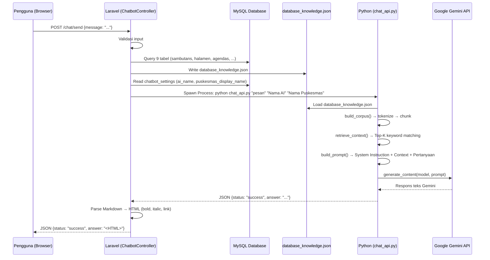

# Product Requirements Document — AI Chatbot Healthcare Assistant

> **Status:** Implemented & Verified
> **Versi:** 1.0.0
> **Terakhir Diperbarui:** Juli 2026
>
> Referensi silang: [`PROJECT_OVERVIEW.md`](./PROJECT_OVERVIEW.md) | [`KNOWLEDGE_PIPELINE.md`](./KNOWLEDGE_PIPELINE.md) | [`AI_GUARDRAILS.md`](./AI_GUARDRAILS.md)

---

## 1. Tujuan

AI Chatbot Healthcare Assistant adalah asisten virtual berbasis teks yang dipasang sebagai widget melayang (*floating widget*) di halaman utama website Puskesmas. Chatbot ini dirancang untuk melayani pertanyaan masyarakat secara mandiri selama 24 jam penuh tanpa membutuhkan staff Puskesmas untuk merespons secara manual.

**Tujuan utama:**
- Mengurangi beban pertanyaan berulang kepada staff Puskesmas (jam buka, jadwal dokter, cara berobat BPJS, dll.).
- Menyajikan informasi resmi Puskesmas secara akurat berdasarkan data yang dikelola admin melalui website.
- Mempertahankan keselamatan pengguna dengan menolak setiap permintaan diagnosis atau rekomendasi medis.

---

## 2. Arsitektur Teknis

Chatbot menggunakan pola **Process Executor**: Laravel memanggil skrip Python sebagai subprocess menggunakan `Symfony\Component\Process\Process`, alih-alih menjalankan server Python yang selalu aktif.

### 2.1 Komponen Utama

| Komponen | Lokasi File | Peran |
|:---------|:-----------|:------|
| HTTP Controller | `app/Http/Controllers/ChatbotController.php` | Menerima pesan, generate KB, spawn Python, parse respons |
| Knowledge Generator | `ChatbotController::generateDatabaseKnowledge()` | Query 9 tabel → `database_knowledge.json` |
| CLI Entry Point | `ai-service/chat_api.py` | Dipanggil oleh Laravel Process, koordinasi modul Python |
| Core AI Logic | `ai-service/main.py` | Load KB, build corpus, context retrieval, Gemini client |
| Prompt Builder | `ai-service/prompt.py` | System instruction + prompt final |
| Knowledge File | `ai-service/knowledge/database_knowledge.json` | Output JSON runtime (tidak dicommit ke Git) |

### 2.2 Alur Lengkap



---

## 3. Mekanisme Knowledge Retrieval

Chatbot tidak mengirimkan seluruh isi knowledge base ke Gemini di setiap permintaan. Sebagai gantinya, digunakan mekanisme **Top-K Keyword Retrieval**:

### 3.1 Langkah Retrieval (dalam `main.py`)

1. **Tokenisasi Pertanyaan:** Pertanyaan pengguna dipecah menjadi token kata menggunakan regex `[a-zA-Z0-9]+`, kemudian difilter dari daftar stopword bahasa Indonesia.

2. **Build Corpus:** Knowledge base di-flatten menjadi array "chunk". Setiap item dalam list JSON (setiap berita, setiap FAQ, setiap halaman) menjadi satu chunk terpisah agar retrieval lebih presisi.

3. **Scoring:** Setiap chunk dihitung skor relevansinya:
   - `overlap_score` = jumlah token yang sama antara pertanyaan dan teks chunk.
   - `category_bonus` = +3 jika kategori chunk cocok dengan kata kunci kategori yang terpicu dari pertanyaan (didefinisikan di `CATEGORY_KEYWORDS` dalam `main.py`).
   - `total_score = overlap_score + category_bonus`

4. **Top-K Selection:** Chunk diurutkan berdasarkan `total_score` secara menurun. Hanya **6 chunk teratas** (Top-6) dengan skor > 0 yang diambil.

5. **Context Block:** 6 chunk terpilih digabungkan menjadi satu blok teks yang dikirimkan ke Gemini sebagai bagian `KONTEKS` dalam prompt.

### 3.2 Daftar Stopword (sebagian)

```
yang, dan, di, ke, dari, untuk, pada, adalah, apa, apakah,
bagaimana, cara, saya, kami, anda, ini, itu, dengan, atau,
akan, bisa, dapat, ada, tidak, juga, the, a, is, how, what,
min, kak, dong, sih, mau, ingin, boleh, kalau, jika, harus
```

---

## 4. Prompt Engineering

Detail lengkap tentang prompt engineering, termasuk sistem instruksi lengkap, dibahas di [`DESIGN_DECISIONS.md`](./DESIGN_DECISIONS.md#prompt-engineering).

### 4.1 Struktur Prompt Final

Prompt yang dikirim ke Gemini terdiri dari **4 bagian utama**:

```
[SYSTEM INSTRUCTION]
Berisi peran AI, aturan utama (11 aturan), dan identitas asisten.
Parameter dinamis: {ai_name}, {puskesmas_name}

[WAKTU SEKARANG (WIB)]
Tanggal saat ini dalam format Indonesia (misal: 20 Juli 2026)

[KONTEKS]
Gabungan maksimal 6 chunk teks paling relevan dari knowledge base.
Atau: "(Tidak ada informasi relevan...)" jika skor semua chunk = 0.

[PERTANYAAN PENGGUNA]
Pertanyaan asli yang diketik oleh pengguna.

[INSTRUKSI JAWABAN]
Perintah eksplisit agar AI menjawab HANYA berdasarkan konteks.
```

### 4.2 Aturan Utama dalam System Instruction (Ringkasan)

| No. | Aturan |
|:----|:-------|
| 1 | Hanya jawab berdasarkan KONTEKS yang diberikan |
| 2 | Jujur jika informasi tidak ditemukan di konteks |
| 3 | Tolak pertanyaan di luar topik Puskesmas |
| 4 | Dilarang keras: diagnosis, resep, rekam medis, data pegawai |
| 5 | Jangan mengaku sebagai dokter/tenaga medis |
| 6 | Gunakan Bahasa Indonesia yang baik dan mudah dipahami |
| 7 | Arahkan ke UGD/darurat jika ada keluhan kesehatan serius |
| 8 | Susun jawaban dengan kalimat sendiri, tidak menyalin mentah |
| 9 | Jika ditanya identitas, jelaskan sebagai AI, bukan manusia |
| 10 | Sertakan tautan markdown `[Teks](url)` jika URL tersedia di konteks |
| 11 | Berikan rangkuman/garis besar jika pertanyaan tentang berita |

---

## 5. Sumber Knowledge

Detail lengkap tentang sumber knowledge dan cara dibangun ada di [`KNOWLEDGE_PIPELINE.md`](./KNOWLEDGE_PIPELINE.md).

Ringkasan sumber data yang dikonsumsi chatbot:

| Tabel MySQL | Data yang Diambil | Keterangan |
|:-----------|:-----------------|:-----------|
| `chatbot_settings` | `ai_name`, `puskesmas_display_name`, `greeting_message` | Identitas asisten AI |
| `sambutans` | `nama`, `judul`, `motto`, `isi` (strip_tags) | Profil kepala instansi |
| `halamen` | `judul`, `isi` (strip_tags), `isi_ocr` | Halaman info + hasil OCR |
| `agendas` | Agenda berstatus `upcoming` | Kegiatan mendatang |
| `beritas` | Berita berstatus `publish` | Artikel dan kabar terbaru |
| `infografis` + `galeris` | `nama`, `keterangan` | Infografis program |
| `dokumen` | Dokumen dengan `is_active = 1` | Dokumen publik aktif |
| `faqs` | Semua FAQ | Tanya jawab umum |
| `inovasi1` | Inovasi dengan `is_active = 1` | Program inovasi Puskesmas |

---

## 6. Integrasi Gemini API

- **SDK:** `google-genai` (Python, bukan REST API manual)
- **Method:** `client.models.generate_content(model, contents)`
- **Model:** `gemini-2.5-flash` (dikonfigurasi via variabel `GEMINI_MODEL` di `ai-service/.env`)
- **Timeout:** 60 detik (dikonfigurasi di `ChatbotController.php` untuk proses Symfony dan di `ask_gemini()` untuk penanganan error)
- **Output:** Teks bebas (bukan JSON terstruktur)

### Penanganan Error Gemini

Error dari Gemini API ditangani di `main.py::ask_gemini()` dengan deteksi pola teks pada pesan error:

| Jenis Error | Deteksi | Respons ke Pengguna |
|:-----------|:--------|:-------------------|
| API Key tidak valid | `"api key"`, `"401"`, `"permission"` | Pesan error soft tentang API Key |
| Kuota habis | `"quota"`, `"429"`, `"rate limit"` | Pesan error soft tentang kuota |
| Timeout | `"timeout"`, `"timed out"` | Pesan error soft tentang koneksi |
| Jaringan mati | `"connection"`, `"network"`, `"unreachable"` | Pesan error soft tentang internet |

---

## 7. Konfigurasi Dinamis dari AI Settings

Nama AI (`ai_name`) dan nama Puskesmas (`puskesmas_display_name`) tidak di-hardcode. Nilainya dibaca dari tabel `chatbot_settings` di setiap request, lalu:
- Diteruskan sebagai argumen CLI ke `chat_api.py`: `python chat_api.py "pesan" "NamaAI" "NamaPuskesmas"`
- Digunakan oleh `build_prompt()` untuk mengisi parameter dalam system instruction secara dinamis.

Dengan demikian, mengubah nama AI atau nama Puskesmas di panel admin akan langsung terefleksi pada kepribadian chatbot tanpa perlu mengubah kode.

Detail konfigurasi ini ada di [`AI_SETTINGS_PRD.md`](./AI_SETTINGS_PRD.md).

---

## 8. Persyaratan Non-Fungsional

| Persyaratan | Spesifikasi | Catatan |
|:-----------|:------------|:--------|
| Ketersediaan | 24/7 (tidak butuh server Python aktif) | Chatbot berjalan on-demand via Process |
| Timeout | Maks 60 detik | Dikonfigurasi di `ChatbotController` |
| Penyimpanan Sesi | `sessionStorage` browser | Riwayat chat tidak hilang saat pindah halaman |
| Keamanan Data | Data sensitif tidak dimasukkan ke KB | Lihat [`AI_GUARDRAILS.md`](./AI_GUARDRAILS.md) |
| Voice Chat | Bergantung pada Web Speech API browser | Fitur disembunyikan jika browser tidak mendukung |

---

## 9. Batasan AI

Batasan lengkap dibahas di dokumen khusus. Lihat [`AI_GUARDRAILS.md`](./AI_GUARDRAILS.md).

---

## 10. Kriteria Penerimaan (Acceptance Criteria)

| Skenario | Hasil yang Diharapkan |
|:---------|:---------------------|
| Tanya "Jam buka puskesmas?" | AI menjawab dengan data jam dari knowledge base |
| Tanya "Obat apa untuk sakit kepala?" | AI menolak dan menyarankan konsultasi ke dokter |
| Tanya "Siapa kamu?" | AI memperkenalkan diri sebagai AI, bukan manusia/tenaga medis |
| Tanya soal berita terbaru | AI merangkum berita dan menyertakan tautan ke halaman berita |
| API Key Gemini tidak valid | AI merespons dengan pesan error yang ramah kepada pengguna |
| Pertanyaan tentang gambar jadwal | AI menjawab berdasarkan teks OCR yang sudah tersimpan di `isi_ocr` |
