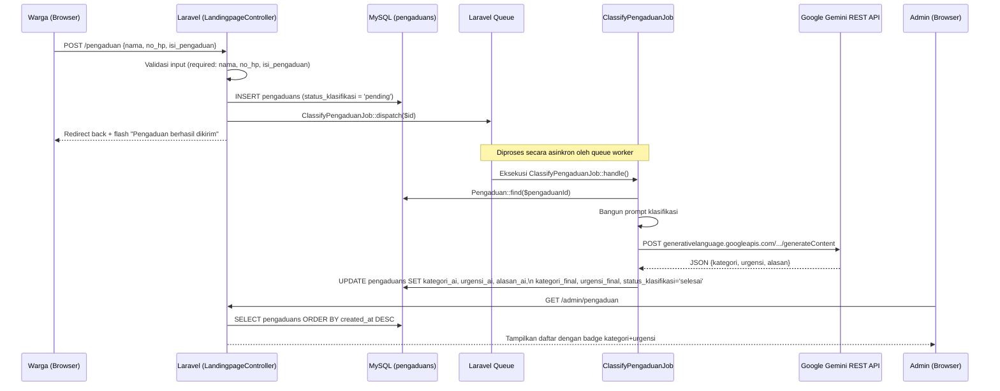

# Product Requirements Document — Klasifikasi Otomatis Pengaduan AI

> **Status:** Implemented & Verified
> **Versi:** 1.0.0
> **Terakhir Diperbarui:** Juli 2026
>
> Referensi silang: [`PROJECT_OVERVIEW.md`](./PROJECT_OVERVIEW.md) | [`AI_GUARDRAILS.md`](./AI_GUARDRAILS.md) | [`DESIGN_DECISIONS.md`](./DESIGN_DECISIONS.md)

---

## 1. Tujuan

Sistem ini mengotomasi proses triage (pemilahan) pengaduan masyarakat. Setiap pengaduan yang masuk melalui form publik akan dianalisa secara otomatis di latar belakang oleh AI menggunakan Google Gemini API, lalu diklasifikasikan ke dalam kategori spesifik dan diberi tingkat urgensi. Hasil ini membantu staff Puskesmas memprioritaskan penanganan tanpa harus membaca dan menilai setiap pengaduan secara manual.

---

## 2. Sumber Kebenaran Tunggal (Single Source of Truth)

Seluruh taksonomi (daftar kategori dan tingkat urgensi) didefinisikan dalam **satu file**: `ai-service/taxonomy.py`.

```python
# ai-service/taxonomy.py

CATEGORIES = [
    "Pendaftaran & Administrasi",
    "Pelayanan Petugas/Medis",
    "Waktu Tunggu & Antrean",
    "Kebersihan & Fasilitas",
    "Ketersediaan Obat",
    "Sarana & Prasarana",
    "Lainnya",
]

URGENCY_LEVELS = ["rendah", "sedang", "tinggi"]

URGENCY_RUBRIC = {
    "tinggi": "berpotensi membahayakan keselamatan/kesehatan, butuh tindakan kurang dari 24 jam",
    "sedang": "mengganggu kualitas layanan, perlu ditindaklanjuti dalam beberapa hari ke depan",
    "rendah": "masukan atau kritik ringan, tidak mendesak",
}
```

> **Aturan Sinkronisasi:** Jika daftar ini diubah, WAJIB diperbarui juga di:
> 1. Enum migration `2026_07_16_000001_add_ai_classification_to_pengaduans_table.php`
> 2. Chip view `resources/views/admin/pengaduan/_klasifikasi_chip.blade.php`
> 3. Method `kategoriOptions()` di `PengaduanController.php`

---

## 3. Alur Kerja (Workflow)



### Alur Sinkron (Fallback untuk Admin)

Ketika admin membuka halaman detail pengaduan dan `status_klasifikasi` masih `pending` (misalnya karena queue worker tidak berjalan), controller secara otomatis memaksa klasifikasi berjalan secara sinkron (`dispatchSync`) agar admin langsung mendapatkan hasilnya:

```php
// PengaduanController.php::edit()
if ($pengaduan->status_klasifikasi === 'pending') {
    try {
        \App\Jobs\ClassifyPengaduanJob::dispatchSync($pengaduan->id);
        $pengaduan = $pengaduan->fresh();
    } catch (\Throwable $e) {
        // abaikan kegagalan klasifikasi agar halaman detail tetap bisa dibuka
    }
}
```

---

## 4. Skema Structured Output Gemini

Klasifikasi pengaduan memanfaatkan fitur **Structured JSON Output** Gemini untuk memastikan format respons selalu valid dan sesuai taksonomi. Skema ini didefinisikan dalam `taxonomy.py::CLASSIFICATION_SCHEMA`:

```python
CLASSIFICATION_SCHEMA = {
    "type": "object",
    "properties": {
        "kategori": {
            "type": "string",
            "enum": CATEGORIES,  # Hanya 7 pilihan yang valid
        },
        "urgensi": {
            "type": "string",
            "enum": URGENCY_LEVELS,  # Hanya: rendah, sedang, tinggi
        },
        "alasan": {
            "type": "string",
            "description": "Penjelasan singkat 1 kalimat...",
        },
    },
    "required": ["kategori", "urgensi", "alasan"],
}
```

Karena `responseMimeType: "application/json"` dan `responseSchema` dikirim ke Gemini, model **tidak bisa mengarang** kategori baru atau mengabaikan format yang diminta.

---

## 5. Aturan Bisnis (Business Rules)

### 5.1 Aturan Prompt Klasifikasi

| Aturan | Implementasi |
|:-------|:------------|
| Hanya `isi_pengaduan` yang dikirim ke AI | `prompt_classify.py`: hanya field `subjek` (50 karakter pertama dari isi) dan `isi` dikirim, bukan `nama` atau `no_hp` |
| AI tidak boleh memberikan saran medis | Tercantum eksplisit dalam system prompt klasifikasi |
| Konten tidak jelas → default ke "Lainnya" + urgensi "rendah" | Tercantum dalam system prompt |
| Hasil AI langsung menjadi nilai aktif | `kategori_final = kategori_ai`, `urgensi_final = urgensi_ai` saat pertama kali diproses |

### 5.2 Audit Trail

Sistem menjaga jejak audit AI yang tidak dapat diubah:

| Kolom | Nilai | Dapat Diubah? |
|:------|:------|:-------------|
| `kategori_ai` | Hasil mentah AI pertama kali | **Tidak** — nilai asli tetap tersimpan permanen |
| `urgensi_ai` | Hasil mentah AI pertama kali | **Tidak** |
| `alasan_ai` | Penjelasan reasoning AI | **Tidak** |
| `kategori_final` | Nilai yang ditampilkan (awalnya = kategori_ai) | **Ya** — admin dapat mengubah |
| `urgensi_final` | Nilai yang ditampilkan (awalnya = urgensi_ai) | **Ya** — admin dapat mengubah |
| `is_overridden` | `false` awalnya | Set `true` otomatis jika admin mengubah |
| `reviewed_by` | `null` awalnya | Diisi ID admin saat override |
| `reviewed_at` | `null` awalnya | Diisi timestamp saat override |

### 5.3 Human Override

Admin dapat mengubah `kategori_final` dan `urgensi_final` melalui chip selector di halaman detail. Perubahan dilakukan via AJAX (HTTP PATCH), tanpa reload halaman penuh:

```
PATCH /admin/pengaduan/{id}/klasifikasi
Body: {kategori_final: "...", urgensi_final: "..."}
```

Saat override, sistem secara otomatis mendeteksi apakah nilai final berbeda dari nilai awal AI:

```php
// PengaduanController.php::updateKlasifikasi()
'is_overridden' => $validated['kategori_final'] !== $pengaduan->kategori_ai
    || $validated['urgensi_final'] !== $pengaduan->urgensi_ai,
```

---

## 6. Sistem Cadangan (Fallback Classifier)

Jika pemanggilan Gemini API gagal karena alasan apapun (kuota habis, jaringan mati, API key tidak valid), Job tidak gagal permanen. Sebaliknya, `ClassifyPengaduanJob::handle()` menangkap exception dan menjalankan `localKeywordClassify()`:

```php
} catch (\Throwable $e) {
    $fallback = $this->localKeywordClassify($pengaduan->isi_pengaduan ?? '', $e->getMessage());
    $pengaduan->update([
        'kategori_ai' => $fallback['kategori'],
        ...
        'status_klasifikasi' => 'selesai', // Tetap 'selesai', bukan 'gagal'
    ]);
}
```

### Cara Kerja Fallback

Keyword matching berbasis kata kunci PHP murni (tanpa ketergantungan API eksternal):

| Kategori | Contoh Kata Kunci |
|:---------|:-----------------|
| Pendaftaran & Administrasi | daftar, registrasi, bpjs, ktp, loket, berkas |
| Pelayanan Petugas/Medis | dokter, perawat, bidan, kasar, lambat, sopan |
| Waktu Tunggu & Antrean | lama, tunggu, antre, antrean, menunggu |
| Kebersihan & Fasilitas | kotor, bau, toilet, wc, sampah, ac, nyamuk |
| Ketersediaan Obat | obat, resep, apotek, habis, kosong, puyer |
| Sarana & Prasarana | parkir, gedung, ambulan, kursi roda, tensi |

Urgensi juga ditentukan secara lokal berdasarkan kata kunci darurat (contoh: `darurat`, `gawat`, `pingsan`, `sekarat`).

### Pesan Alasan Fallback

Isi kolom `alasan_ai` saat fallback menjelaskan penyebab kegagalan secara transparan kepada admin:

- **Kuota/Key API:** _"Klasifikasi lokal otomatis (kuota/key API Gemini habis atau tidak valid)."_
- **Koneksi:** _"Klasifikasi lokal otomatis (kegagalan REST API/koneksi)."_

---

## 7. Skema Database

Tambahan kolom pada tabel `pengaduans` (migration `2026_07_16_...`):

| Kolom | Tipe | Default | Keterangan |
|:------|:-----|:--------|:-----------|
| `kategori_ai` | `varchar(100)` | `null` | Kategori saran AI — audit trail |
| `urgensi_ai` | `enum('rendah','sedang','tinggi')` | `null` | Urgensi saran AI — audit trail |
| `alasan_ai` | `text` | `null` | Reasoning AI dalam 1 kalimat |
| `kategori_final` | `varchar(100)` | `null` | Kategori aktif (dapat di-override) |
| `urgensi_final` | `enum('rendah','sedang','tinggi')` | `null` | Urgensi aktif (dapat di-override) |
| `is_overridden` | `boolean` | `false` | Flag apakah admin telah mengubah |
| `status_klasifikasi` | `enum('pending','selesai','gagal')` | `'pending'` | Status proses background job |
| `reviewed_by` | `bigint unsigned` | `null` | FK ke `users.id` |
| `reviewed_at` | `timestamp` | `null` | Waktu admin melakukan review |

Indeks yang ditambahkan: `status_klasifikasi`, `urgensi_final`.

---

## 8. Konfigurasi Queue

Job ini menggunakan **Laravel Queue Driver Database**. Konfigurasi yang dibutuhkan:

```env
# /.env Laravel
QUEUE_CONNECTION=database
GEMINI_API_KEY=<api_key_anda>
```

Parameter Job:

```php
// ClassifyPengaduanJob.php
public int $tries = 2;      // Maksimal 2 percobaan
public int $timeout = 30;   // Timeout per percobaan: 30 detik
```

---

## 9. Kriteria Penerimaan (Acceptance Criteria)

| Skenario | Hasil yang Diharapkan |
|:---------|:---------------------|
| Warga kirim "Toiletnya sangat kotor" | Badge: "Kebersihan & Fasilitas" + urgensi "Rendah/Sedang" |
| Warga kirim "Dokter kasar dan tidak sopan" | Badge: "Pelayanan Petugas/Medis" + urgensi "Sedang" |
| Warga kirim "obat saya habis dan tidak ada stok" | Badge: "Ketersediaan Obat" + urgensi "Sedang" |
| Gemini API down saat pengaduan masuk | Klasifikasi fallback lokal berjalan, status = 'selesai' |
| Admin override kategori | `is_overridden = true`, `reviewed_by`, `reviewed_at` terisi, nilai AI asli tetap tersimpan |
| Admin buka detail pengaduan 'pending' | Klasifikasi sinkron dijalankan, halaman menampilkan hasil |
