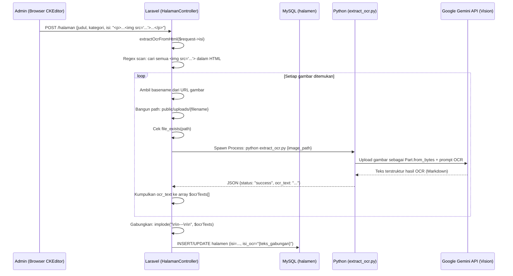

# Pipeline Ekstraksi OCR (Optical Character Recognition)

> Referensi silang: [`KNOWLEDGE_PIPELINE.md`](./KNOWLEDGE_PIPELINE.md) | [`AI_CHATBOT_PRD.md`](./AI_CHATBOT_PRD.md) | [`DESIGN_DECISIONS.md`](./DESIGN_DECISIONS.md)

---

## 1. Latar Belakang & Masalah yang Dipecahkan

Halaman informasi Puskesmas (jadwal pelayanan, poster kegiatan, SOP, alur pelayanan, dll.) sering dibuat dalam format gambar (JPG, PNG) dan diunggah melalui editor CKEditor di admin panel. Teks di dalam gambar tidak bisa dibaca oleh sistem teks biasa.

Sebelum fitur OCR ini ada, chatbot tidak bisa menjawab pertanyaan seperti "Kapan jadwal poli anak?" karena informasi tersebut tersimpan sebagai gambar, bukan teks yang bisa diproses.

### Solusi: Pre-extraction OCR

Alih-alih mengirim gambar secara langsung ke Gemini setiap kali ada percakapan chatbot (yang mahal dan lambat), sistem menggunakan pendekatan **pre-extraction**:

- Gambar diproses **sekali saja** saat diunggah oleh admin.
- Hasil ekstraksi teks yang terstruktur disimpan ke kolom `isi_ocr` di database.
- Chatbot membaca teks dari kolom `isi_ocr` yang sudah ada — tanpa perlu mengirim gambar ulang.

---

## 2. Perbandingan Pendekatan

| Aspek | Sebelum (Real-time OCR) | Sesudah (Pre-extraction OCR) |
|:------|:------------------------|:---------------------------|
| Waktu OCR | Di setiap percakapan chatbot | Satu kali saat upload/update |
| Biaya token Gemini | Tinggi (gambar setiap chat) | Rendah (hanya saat admin input) |
| Latensi chatbot | Lebih lambat (proses gambar tiap chat) | Lebih cepat (baca teks dari DB) |
| Keandalan | Bergantung API saat chat | Bergantung API saat admin input saja |
| Akurasi | Sama | Sama |

---

## 3. Alur OCR (Pre-extraction Pipeline)

### 3.1 Saat Admin Membuat/Memperbarui Halaman Informasi



### 3.2 File yang Terlibat

| File | Peran |
|:-----|:------|
| `app/Http/Controllers/Admin/HalamanController.php` | Orkestrasi: trigger OCR, gabungkan hasil |
| `ai-service/extract_ocr.py` | Worker: kirim gambar ke Gemini, return JSON |

---

## 4. Detail Implementasi `extract_ocr.py`

Script ini adalah program Python standalone yang menerima **path gambar sebagai argumen CLI** dan mengembalikan **JSON ke stdout**:

```bash
# Cara dipanggil dari PHP:
python ai-service/extract_ocr.py /path/absolut/ke/gambar.jpg
```

**Output sukses:**
```json
{"status": "success", "ocr_text": "## JADWAL PELAYANAN\n| Poli | Hari | Jam |..."}
```

**Output gagal:**
```json
{"status": "error", "message": "GEMINI_API_KEY tidak ditemukan di file .env"}
```

### Prompt OCR yang Digunakan

Prompt yang dikirim ke Gemini Vision dirancang khusus agar output-nya optimal untuk dikonsumsi LLM, bukan untuk dibaca manusia:

```python
prompt = (
    "Lakukan OCR mendetail pada gambar ini. Anda harus memahami konteks visual gambar "
    "(seperti jadwal pelayanan, poster, infografis, banner, SOP, alur pelayanan, pengumuman, dll.). "
    "Ekstrak semua informasi dalam format yang terstruktur, lengkap, dan kontekstual "
    "(misalnya tabel Markdown, daftar, header). "
    "Pertahankan hubungan antarjudul, isi, tabel, daftar, tanggal, jam, lokasi, nomor kontak, "
    "serta semua informasi penting lainnya. "
    "Jangan menambahkan, mengubah, atau mengasumsikan informasi yang tidak terdapat pada gambar. "
    "Tulis murni berdasarkan konten gambar. "
    "Optimalkan tata letak dan kata-kata agar mudah dipahami LLM (Large Language Model) sehingga "
    "chatbot AI dapat menjawab berbagai pertanyaan pengguna mengenai gambar ini dengan sangat akurat. "
    "Keluarkan hasilnya dalam Bahasa Indonesia."
)
```

**Tujuan desain prompt ini:**
- Output berformat Markdown (tabel, heading, list) — mudah di-parse dan dipahami LLM saat retrieval.
- Mempertahankan relasi semantik (jam → poli → lokasi) yang ada di gambar.
- Tidak menambahkan informasi yang tidak ada (mencegah halusinasi OCR).
- Output dalam Bahasa Indonesia untuk konsistensi dengan knowledge base.

### Format Pengiriman Gambar ke Gemini

Gambar **tidak di-upload** ke Google Cloud Storage. Gambar dikirim langsung sebagai data biner dalam request API:

```python
with open(path, "rb") as f:
    img_data = f.read()

part = types.Part.from_bytes(data=img_data, mime_type=mime_type)

response = client.models.generate_content(
    model=model_name,
    contents=[part, prompt]  # Gambar + Prompt dalam satu request
)
```

**MIME type yang didukung:** `image/jpeg`, `image/png`, `image/webp`, `image/gif`

---

## 5. Backfill OCR pada Data Lama

Migration `2026_07_15_142435_add_isi_ocr_to_halamen_table.php` secara otomatis melakukan backfill OCR pada semua rekord di tabel `halamen` yang sudah ada sebelum fitur ini ditambahkan:

```php
// Di dalam migration::up()
$halamen = DB::table('halamen')->get();
foreach ($halamen as $h) {
    // Scan img tags dari kolom 'isi' yang sudah ada
    preg_match_all('/]+src="([^">]+)"/i', $h->isi, $matches);
    // ... proses setiap gambar dengan extract_ocr.py
    DB::table('halamen')->where('id', $h->id)->update(['isi_ocr' => $combinedOcr]);
}
```

Error selama backfill tidak menghentikan migration (dikatch dan diabaikan), sehingga migration tetap berhasil meskipun sebagian gambar gagal di-OCR.

---

## 6. Penyimpanan Hasil OCR

Hasil dari satu halaman informasi yang memiliki **banyak gambar** digabungkan menjadi satu string dengan pemisah `---`:

```
# Konten dari Gambar 1: Jadwal Pelayanan
## JADWAL PELAYANAN PUSKESMAS MARUNGGI
| Hari | Poli | Jam |
|------|------|-----|
| Senin | Poli Umum | 08:00 - 12:00 |
...

---

# Konten dari Gambar 2: Alur Pendaftaran BPJS
1. Bawa KTP dan Kartu BPJS
2. Menuju loket pendaftaran
...
```

String gabungan ini disimpan di kolom `isi_ocr` (tipe `longtext`) di tabel `halamen`.

---

## 7. Penanganan Error & Fallback

| Kondisi Error | Penanganan |
|:-------------|:-----------|
| Gambar tidak ditemukan di disk | Di-skip, log Laravel error |
| Gemini API error (API key, kuota) | Di-skip, log Laravel error |
| Python process timeout (>60 detik) | Di-skip, log Laravel error |
| Response Gemini kosong | Raise ValueError, di-skip |

Ketika OCR gagal untuk satu gambar, halaman informasi tetap tersimpan. Kolom `isi_ocr` akan `null` atau berisi hasil OCR gambar lainnya yang berhasil. Chatbot masih bisa menjawab berdasarkan teks HTML (kolom `isi` setelah `strip_tags`), hanya saja informasi visual dari gambar tidak tersedia.

---

## 8. Catatan Keamanan

- Hanya gambar dari `public/uploads/` yang diproses (lokasi upload resmi admin).
- Tidak ada input path dari pengguna publik yang diterima di endpoint OCR.
- Gambar dikirim ke Gemini tanpa metadata tambahan (nama file atau informasi pengguna yang mengunggah).
