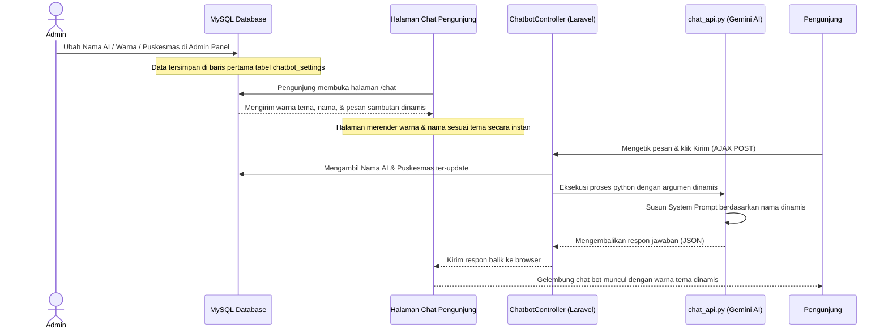

# Dokumentasi Modul Setting AI Chatbot

Modul ini dikembangkan untuk memberikan fleksibilitas kepada Administrator Puskesmas Marunggi dalam mengelola identitas, tampilan, dan kepribadian (instruksi AI) dari asisten virtual resmi tanpa harus menyentuh kode program.

---

## 1. Fitur Utama

- **Pengaturan Identitas**:
  - Mengubah **Nama AI** (Virtual Assistant) yang akan ditampilkan sebagai pengirim pesan.
  - Mengubah **Nama Puskesmas** yang digunakan pada judul utama dan disinkronkan ke instruksi sistem AI.
  - Mengubah **Pesan Sambutan (Greeting)** pertama kali ketika ruang obrolan dibuka.
- **Kustomisasi Tema Visual (Warna)**:
  - **Template Warna (Preset)**: Memilih salah satu dari 5 pilihan palet warna utama yang siap pakai.
  - **Atur Warna Manual**: Memilih warna bebas menggunakan tombol *color picker* atau mengetikkan kode HEX (misal: `#ef4444`).
  - **Sinkronisasi Warna Menyeluruh**: Mengubah warna header obrolan, bulatan ikon pengguna, gelembung pesan pengguna, tombol kirim, hingga efek fokus kolom input.
  - **Deteksi Kontras Otomatis**: Secara cerdas menghitung tingkat kecerahan (*luminance*) warna dasar yang dipilih. Jika warna dasar terang (misal: kuning/putih), teks di atasnya otomatis berubah menjadi hitam/gelap. Sebaliknya, jika warna dasar gelap (misal: merah/hijau), teks otomatis berwarna putih.
  - **Validasi Format Real-time**: Menampilkan lencana validasi langsung di bawah input warna jika format HEX yang diketikkan valid atau tidak valid.
- **Status Layanan**:
  - Tombol radio untuk mengaktifkan atau menonaktifkan chatbot untuk sementara waktu (pemeliharaan). Jika dinonaktifkan, halaman chat pengunjung akan menampilkan pemberitahuan bahwa layanan sedang tidak aktif.

---

## 2. Skema Database

Data pengaturan disimpan dalam tabel tunggal `chatbot_settings` dengan struktur sebagai berikut:

| Nama Kolom | Tipe Data | Nullable | Default | Keterangan |
| :--- | :--- | :---: | :--- | :--- |
| `id` | `bigint unsigned` | No | *Auto-increment* | Primary Key |
| `ai_name` | `string(100)` | No | `'Asisten Puskesmas'` | Nama tampilan bot |
| `puskesmas_display_name` | `string(150)` | No | `'Puskesmas Marunggi'` | Nama instansi puskesmas |
| `greeting_message` | `text` | Yes | *Null* | Pesan sambutan pertama kali |
| `primary_color` | `string(20)` | No | `'#1e6b4d'` | Kode warna utama (HEX) |
| `status` | `enum('active', 'inactive')` | No | `'active'` | Status aktif layanan chatbot |
| `logo_chatbot` | `string(255)` | Yes | *Null* | Path file logo (disiapkan untuk masa mendatang) |
| `created_at` | `timestamp` | Yes | *Null* | Waktu data dibuat |
| `updated_at` | `timestamp` | Yes | *Null* | Waktu data diperbarui |

---

## 3. Daftar Berkas (Files) yang Terlibat

### A. Berkas Baru (Dibuat)
1. **Migration File**:
   - `database/migrations/2026_07_14_105838_create_chatbot_settings_table.php`
2. **Model**:
   - `app/Models/ChatbotSetting.php`
3. **Seeder**:
   - `database/seeders/ChatbotSettingsSeeder.php`
4. **Controller Admin**:
   - `app/Http/Controllers/Admin/ChatbotSettingController.php`
5. **View Admin**:
   - `resources/views/admin/chatbot-setting/index.blade.php`

### B. Berkas yang Dimodifikasi (Modified)
1. **Routes**:
   - `routes/web.php`
2. **Admin Sidebar Layout**:
   - `resources/views/template/layout.blade.php`
3. **Halaman Chat Pengunjung**:
   - `resources/views/chat.blade.php`
4. **Chat Controller Utama**:
   - `app/Http/Controllers/ChatbotController.php`
5. **Python AI Scripts**:
   - `ai-service/chat_api.py` dan `ai-service/prompt.py`

---

## 4. Alur Kerja Sinkronisasi (Flow)



---

## 5. Logika Perhitungan Kontras Teks

Untuk mendeteksi apakah teks di atas warna latar belakang harus putih atau hitam, digunakan rumus YIQ luminance di bawah ini (diterapkan di Blade PHP dan Alpine.js):

```php
function getContrastColor($hexColor) {
    $hexColor = str_replace('#', '', $hexColor);
    if (strlen($hexColor) == 3) {
        $hexColor = str_repeat(substr($hexColor,0,1), 2) . str_repeat(substr($hexColor,1,1), 2) . str_repeat(substr($hexColor,2,1), 2);
    }
    $r = hexdec(substr($hexColor, 0, 2));
    $g = hexdec(substr($hexColor, 2, 2));
    $b = hexdec(substr($hexColor, 4, 2));
    
    // Rumus YIQ
    $yiq = (($r * 299) + ($g * 587) + ($b * 114)) / 1000;
    
    // Jika terang (>= 128) beri teks gelap, jika gelap (< 128) beri teks putih
    return ($yiq >= 128) ? '#0f172a' : '#ffffff';
}
```
