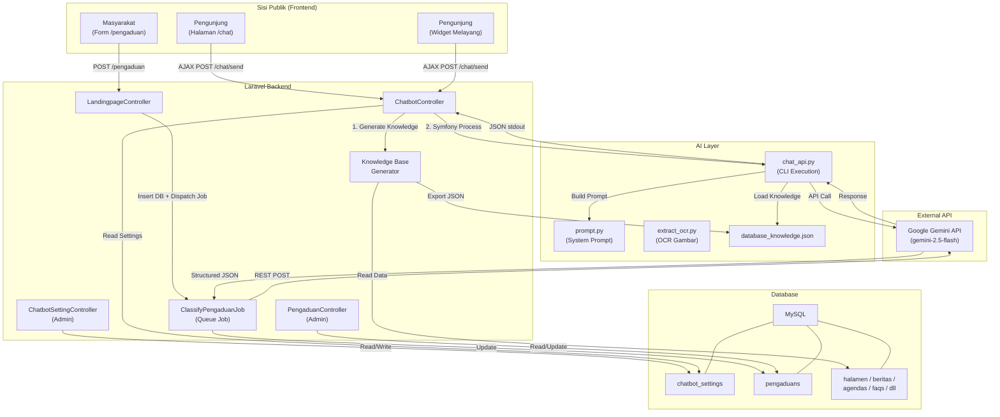
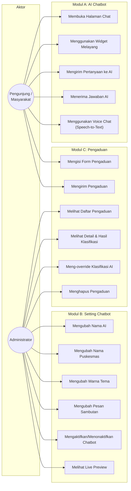
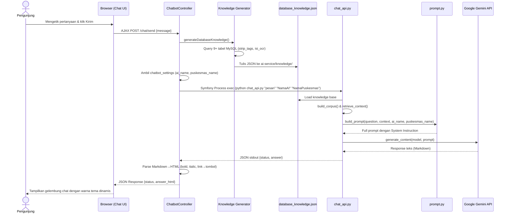
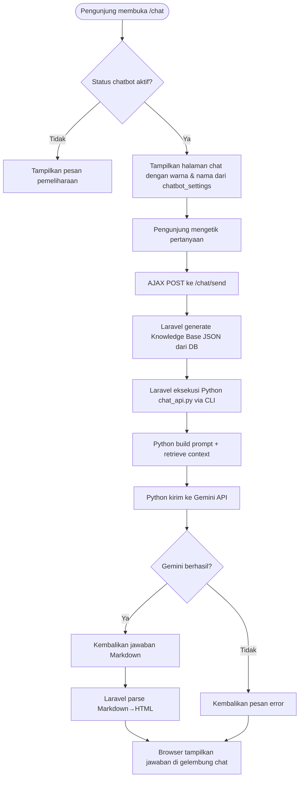
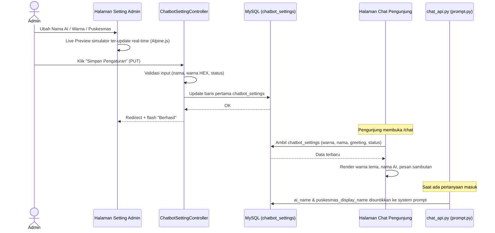
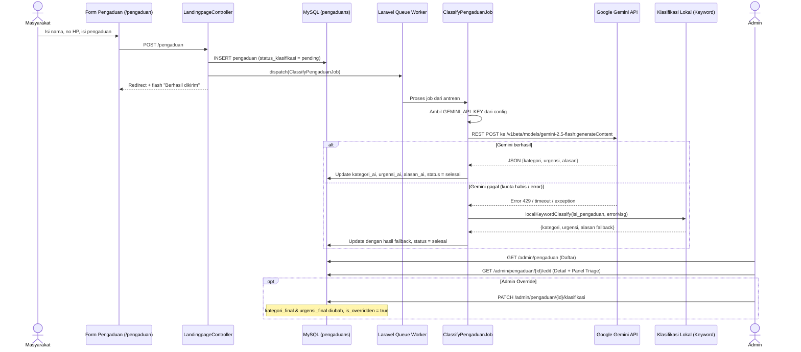
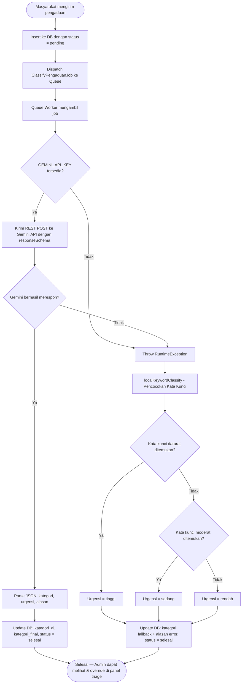
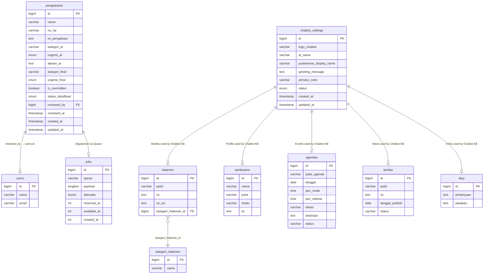

# Dokumentasi Teknis Fitur Tambahan
## AI Chatbot, Setting Chatbot, & Pengaduan dengan Klasifikasi AI

| Informasi Dokumen        |                                                   |
| :----------------------- | :------------------------------------------------ |
| **Nama Proyek**          | Sistem Informasi Puskesmas Marunggi — Fitur AI    |
| **Versi**                | 1.0.0                                             |
| **Tanggal**              | 17 Juli 2026                                      |
| **Status**               | Implemented & Verified                            |
| **Tech Stack**           | Laravel 13, PHP 8.2, MySQL, Python 3, Google Gemini API (gemini-2.5-flash) |

---

## Daftar Isi

1. [Pendahuluan & Latar Belakang](#1-pendahuluan--latar-belakang)
2. [Ruang Lingkup Modul](#2-ruang-lingkup-modul)
3. [Arsitektur Sistem](#3-arsitektur-sistem)
4. [Use Case Diagram](#4-use-case-diagram)
5. [Modul A — AI Chatbot Publik](#5-modul-a--ai-chatbot-publik)
6. [Modul B — Setting AI Chatbot (Admin)](#6-modul-b--setting-ai-chatbot-admin)
7. [Modul C — Pengaduan Masyarakat & Klasifikasi AI](#7-modul-c--pengaduan-masyarakat--klasifikasi-ai)
8. [Skema Database](#8-skema-database)
9. [Entity Relationship Diagram (ERD)](#9-entity-relationship-diagram-erd)
10. [Daftar Berkas (File Inventory)](#10-daftar-berkas-file-inventory)
11. [Konfigurasi Lingkungan (.env)](#11-konfigurasi-lingkungan-env)
12. [Rute Aplikasi (Routes)](#12-rute-aplikasi-routes)
13. [Panduan Pengembangan Lokal](#13-panduan-pengembangan-lokal)
14. [Taksonomi & Sumber Kebenaran](#14-taksonomi--sumber-kebenaran)
15. [Keamanan & Batasan](#15-keamanan--batasan)

---

## 1. Pendahuluan & Latar Belakang

Sistem Informasi Puskesmas Marunggi merupakan aplikasi web berbasis Laravel yang telah memiliki modul CMS (Content Management System) dan modul PKK/Dasawisma. Dokumen ini secara **khusus** mendokumentasikan **tiga modul fitur tambahan** yang dikembangkan di atas sistem yang sudah ada:

1. **AI Chatbot Publik** — Asisten virtual berbasis Google Gemini API yang melayani tanya jawab masyarakat seputar informasi layanan Puskesmas secara real-time.
2. **Setting AI Chatbot (Admin Panel)** — Panel konfigurasi bagi Administrator untuk mengatur identitas, tampilan warna, dan kepribadian chatbot tanpa menyentuh kode program.
3. **Pengaduan Masyarakat & Klasifikasi AI** — Form pengaduan publik yang terintegrasi dengan sistem klasifikasi otomatis berbasis AI (kategori, urgensi, dan alasan) dengan mekanisme triage di panel admin.

Ketiga modul ini saling terhubung melalui satu kunci API Google Gemini yang sama dan menggunakan arsitektur asinkron (Queue Job) serta eksekusi CLI Python untuk berkomunikasi dengan Gemini API.

---

## 2. Ruang Lingkup Modul

| No | Modul                        | Aktor                   | Deskripsi Singkat                                                                                  |
|:---|:-----------------------------|:------------------------|:---------------------------------------------------------------------------------------------------|
| A  | AI Chatbot Publik            | Pengunjung / Masyarakat | Tanya jawab interaktif melalui halaman `/chat` dan widget melayang (*floating button*)              |
| B  | Setting AI Chatbot           | Administrator           | Mengubah nama AI, nama puskesmas, warna tema, pesan sambutan, dan status aktif chatbot              |
| C  | Pengaduan & Klasifikasi AI   | Masyarakat & Admin      | Masyarakat mengirim aduan via form `/pengaduan`, AI mengklasifikasi otomatis, Admin triage di panel |

---

## 3. Arsitektur Sistem

### 3.1 Diagram Arsitektur Keseluruhan



### 3.2 Perbedaan Mekanisme Pemanggilan AI

| Komponen                  | Metode Pemanggilan            | Alasan                                                                 |
|:--------------------------|:------------------------------|:-----------------------------------------------------------------------|
| **AI Chatbot**            | CLI Python via `Symfony\Process` | Butuh knowledge retrieval & prompt engineering kompleks di sisi Python   |
| **Klasifikasi Pengaduan** | REST API langsung dari Laravel (HTTP POST) | Prompt sederhana & skema respons ketat, tidak butuh logika Python     |

---

## 4. Use Case Diagram



---

## 5. Modul A — AI Chatbot Publik

### 5.1 Deskripsi Fungsional

Chatbot merupakan asisten virtual berbasis Google Gemini API yang menjawab pertanyaan masyarakat **hanya** berdasarkan data resmi yang tersimpan di database Puskesmas (Knowledge Base dinamis). Chatbot **tidak** menggunakan pengetahuan umum dan **tidak** memberikan diagnosis medis.

**Fitur Utama:**
- Halaman chat penuh (`/chat`) dengan tampilan percakapan interaktif
- Widget melayang (*floating button*) di seluruh halaman publik
- Sinkronisasi riwayat chat antar widget dan halaman penuh via `sessionStorage`
- Konversi Markdown → HTML (bold, italic, link → tombol navigasi)
- Knowledge Base dinamis yang digenerate dari database MySQL setiap permintaan
- Pre-extraction OCR untuk gambar jadwal/brosur yang diunggah admin
- Fitur Voice Chat (Speech-to-Text & Text-to-Speech) berbasis Web Speech API browser

### 5.2 Sequence Diagram — Alur Tanya Jawab



### 5.3 Activity Diagram — Chatbot



---

## 6. Modul B — Setting AI Chatbot (Admin)

### 6.1 Deskripsi Fungsional

Panel administrasi yang memungkinkan admin mengonfigurasi seluruh aspek identitas dan tampilan chatbot secara instan tanpa menyentuh kode program.

**Fitur Utama:**

| Fitur                           | Keterangan                                                                                              |
|:--------------------------------|:--------------------------------------------------------------------------------------------------------|
| Pengaturan Nama AI              | Mengubah nama yang ditampilkan sebagai pengirim pesan bot (contoh: *"Si-Peka AI"*)                       |
| Pengaturan Nama Puskesmas       | Nama instansi disinkronkan ke instruksi sistem AI (system prompt)                                        |
| Pengaturan Pesan Sambutan       | Pesan yang muncul pertama kali saat halaman chat dibuka                                                  |
| Template Warna Preset           | 5 pilihan warna siap pakai: Hijau `#1e6b4d`, Merah `#ef4444`, Biru `#3b82f6`, Ungu `#8b5cf6`, Oranye `#f97316` |
| Input Warna Manual (HEX)        | Color picker atau ketik kode HEX langsung                                                                |
| Validasi Format HEX Real-time   | Badge hijau/merah yang menampilkan status validitas format HEX                                           |
| Deteksi Kontras Otomatis (YIQ)  | Teks otomatis berubah putih/hitam berdasarkan luminance warna dasar                                      |
| Sinkronisasi Warna              | Warna header, ikon user, gelembung pesan, tombol kirim, dan fokus input sinkron                          |
| Status Aktif/Nonaktif           | Toggle status chatbot untuk pemeliharaan                                                                 |
| Live Preview Simulator          | Mockup handphone di sisi kanan form yang merender perubahan secara real-time                             |

### 6.2 Rumus Kontras Warna YIQ

```php
function getContrastColor($hexColor) {
    $hexColor = str_replace('#', '', $hexColor);
    $r = hexdec(substr($hexColor, 0, 2));
    $g = hexdec(substr($hexColor, 2, 2));
    $b = hexdec(substr($hexColor, 4, 2));

    // Rumus YIQ Luminance
    $yiq = (($r * 299) + ($g * 587) + ($b * 114)) / 1000;

    // >= 128 → teks gelap, < 128 → teks putih
    return ($yiq >= 128) ? '#0f172a' : '#ffffff';
}
```

### 6.3 Sequence Diagram — Alur Setting Admin



---

## 7. Modul C — Pengaduan Masyarakat & Klasifikasi AI

### 7.1 Deskripsi Fungsional

Setiap pengaduan/keluhan warga yang dikirimkan melalui form publik (`/pengaduan`) akan diproses secara **asinkron** di latar belakang menggunakan **Laravel Queue Job** yang memanggil Google Gemini API secara langsung (tanpa perantara FastAPI/Python).

**Fitur Utama:**

1. **Form Pengaduan Publik** — Masyarakat mengisi nama, nomor HP, dan isi aduan
2. **Klasifikasi Otomatis AI** — Gemini menentukan 1 kategori dari 7 opsi, tingkat urgensi, dan alasan
3. **Skema Respons Ketat** — `responseSchema` memaksa output JSON terstruktur dari Gemini
4. **Sistem Cadangan (Fallback)** — Jika API gagal (kuota habis/koneksi), klasifikasi lokal berbasis kata kunci otomatis berjalan
5. **Panel Triage Admin** — Admin melihat hasil klasifikasi AI dan dapat meng-override kategori/urgensi
6. **Audit Trail** — Hasil AI asli (`kategori_ai`, `urgensi_ai`) tetap tersimpan walau admin override (`kategori_final`, `urgensi_final`)
7. **Klasifikasi Sinkron On-Demand** — Jika admin membuka detail aduan yang masih `pending`, klasifikasi dipaksa berjalan sinkron

### 7.2 Sequence Diagram — Alur Pengaduan & Klasifikasi



### 7.3 Activity Diagram — Klasifikasi Pengaduan



### 7.4 Mekanisme Override Admin

Ketika admin meng-override klasifikasi AI di panel triage:

```
PATCH /admin/pengaduan/{id}/klasifikasi
Body: { kategori_final, urgensi_final }
```

Sistem melakukan:
1. Menyimpan nilai `kategori_final` dan `urgensi_final` baru
2. Menandai `is_overridden = true` jika nilai final berbeda dari saran AI
3. Menyimpan `reviewed_by` (user ID admin) dan `reviewed_at` (timestamp)
4. Kolom `kategori_ai` dan `urgensi_ai` **tidak berubah** (jejak audit asli AI)

---

## 8. Skema Database

### 8.1 Tabel `chatbot_settings`

Menyimpan konfigurasi identitas dan tampilan AI Chatbot (1 baris data).

| Kolom                    | Tipe Data          | Nullable | Default               | Keterangan                           |
|:-------------------------|:-------------------|:--------:|:----------------------|:-------------------------------------|
| `id`                     | `bigint unsigned`  | No       | Auto-increment        | Primary Key                          |
| `logo_chatbot`           | `varchar(255)`     | Yes      | `NULL`                | Path file logo (untuk pengembangan)  |
| `ai_name`                | `varchar(100)`     | No       | `'Asisten Puskesmas'` | Nama tampilan bot                    |
| `puskesmas_display_name` | `varchar(150)`     | No       | `'Puskesmas Marunggi'`| Nama instansi, disinkronkan ke AI    |
| `greeting_message`       | `text`             | Yes      | `NULL`                | Pesan sambutan pertama kali          |
| `primary_color`          | `varchar(20)`      | No       | `'#1e6b4d'`           | Kode warna utama HEX                |
| `status`                 | `enum('active','inactive')` | No | `'active'`      | Status keaktifan layanan chatbot     |
| `created_at`             | `timestamp`        | Yes      | `NULL`                | Timestamp pembuatan                  |
| `updated_at`             | `timestamp`        | Yes      | `NULL`                | Timestamp perubahan terakhir         |

**Migrasi:** `2026_07_14_105838_create_chatbot_settings_table.php`

---

### 8.2 Tabel `pengaduans`

Menyimpan data pengaduan masyarakat beserta hasil klasifikasi AI.

| Kolom                 | Tipe Data          | Nullable | Default    | Keterangan                                        |
|:----------------------|:-------------------|:--------:|:-----------|:--------------------------------------------------|
| `id`                  | `bigint unsigned`  | No       | Auto-inc   | Primary Key                                       |
| `nama`                | `varchar`          | No       | —          | Nama pelapor                                      |
| `no_hp`               | `varchar`          | No       | —          | Nomor HP pelapor                                  |
| `isi_pengaduan`       | `text`             | No       | —          | Isi lengkap keluhan                               |
| `kategori_ai`         | `varchar(100)`     | Yes      | `NULL`     | Kategori hasil AI (jejak audit, tidak berubah)     |
| `urgensi_ai`          | `enum('rendah','sedang','tinggi')` | Yes | `NULL` | Urgensi hasil AI (jejak audit)             |
| `alasan_ai`           | `text`             | Yes      | `NULL`     | Alasan AI (1 kalimat argumentasi)                 |
| `kategori_final`      | `varchar(100)`     | Yes      | `NULL`     | Kategori aktif (= AI awal, berubah jika override) |
| `urgensi_final`       | `enum('rendah','sedang','tinggi')` | Yes | `NULL` | Urgensi aktif (= AI awal, berubah jika override) |
| `is_overridden`       | `boolean`          | No       | `false`    | Tanda apakah admin telah override                 |
| `status_klasifikasi`  | `enum('pending','selesai','gagal')` | No | `'pending'` | Status proses klasifikasi                   |
| `reviewed_by`         | `bigint unsigned`  | Yes      | `NULL`     | ID admin yang melakukan override → FK ke `users.id` |
| `reviewed_at`         | `timestamp`        | Yes      | `NULL`     | Timestamp override                                |
| `created_at`          | `timestamp`        | Yes      | `NULL`     | Timestamp pengaduan dibuat                        |
| `updated_at`          | `timestamp`        | Yes      | `NULL`     | Timestamp update terakhir                         |

**Index:** `status_klasifikasi`, `urgensi_final`

**Migrasi awal (tabel):** Sudah ada sebelum pengembangan fitur AI
**Migrasi tambahan (kolom AI):** `2026_07_16_000001_add_ai_classification_to_pengaduans_table.php`

---

### 8.3 Tabel Pendukung Knowledge Base Chatbot

Chatbot membaca data dari tabel-tabel berikut untuk menyusun basis pengetahuan dinamis:

| Tabel                | Fungsi dalam Knowledge Base                                   |
|:---------------------|:--------------------------------------------------------------|
| `chatbot_settings`   | Identitas AI: nama asisten, nama puskesmas, pesan sambutan    |
| `sambutans`          | Profil & kata sambutan kepala instansi                        |
| `halamen`            | Visi misi, sejarah, jadwal, program (termasuk kolom `isi_ocr`)|
| `agendas`            | Agenda kegiatan mendatang (status = `upcoming`)               |
| `beritas`            | Artikel berita (status = `publish`)                           |
| `infografis`         | Data infografis program                                       |
| `galeris`            | Galeri foto (jenis = `infografis`)                            |
| `dokumen`            | Dokumen/SOP publik (is_active = 1)                            |
| `faqs`               | Pertanyaan yang sering diajukan                               |
| `inovasi1`           | Program inovasi puskesmas (is_active = 1)                     |

---

### 8.4 Tabel `jobs` (Laravel Queue)

Tabel bawaan Laravel untuk antrean pekerjaan latar belakang. Digunakan oleh `ClassifyPengaduanJob`.

| Kolom          | Tipe Data          | Keterangan                          |
|:---------------|:-------------------|:------------------------------------|
| `id`           | `bigint unsigned`  | Primary Key                         |
| `queue`        | `varchar`          | Nama antrean (`default`)            |
| `payload`      | `longtext`         | Data serialisasi job                |
| `attempts`     | `tinyint unsigned` | Jumlah percobaan                    |
| `reserved_at`  | `int unsigned`     | Timestamp job di-reserve            |
| `available_at` | `int unsigned`     | Timestamp job tersedia              |
| `created_at`   | `int unsigned`     | Timestamp job dibuat                |

**Migrasi:** `0001_01_01_000002_create_jobs_table.php`

---

## 9. Entity Relationship Diagram (ERD)

ERD berikut menggambarkan **hanya** tabel-tabel yang relevan dengan tiga modul fitur tambahan:



---

## 10. Daftar Berkas (File Inventory)

### 10.1 Berkas Baru (Ditambahkan)

#### A. Laravel Backend (PHP)

| Jenis       | Path Relatif                                                                    | Keterangan                                        |
|:------------|:--------------------------------------------------------------------------------|:--------------------------------------------------|
| Model       | `app/Models/ChatbotSetting.php`                                                 | Eloquent model untuk tabel `chatbot_settings`      |
| Model       | `app/Models/Pengaduan.php`                                                      | Eloquent model untuk tabel `pengaduans`            |
| Controller  | `app/Http/Controllers/ChatbotController.php`                                    | Handler chat publik + knowledge base generator     |
| Controller  | `app/Http/Controllers/Admin/ChatbotSettingController.php`                        | CRUD pengaturan chatbot admin                      |
| Controller  | `app/Http/Controllers/Admin/PengaduanController.php`                            | CRUD pengaduan admin + panel triage                |
| Job         | `app/Jobs/ClassifyPengaduanJob.php`                                             | Queue job klasifikasi AI + fallback lokal          |
| Migration   | `database/migrations/2026_07_14_105838_create_chatbot_settings_table.php`       | Buat tabel `chatbot_settings`                      |
| Migration   | `database/migrations/2026_07_15_142435_add_isi_ocr_to_halamen_table.php`        | Tambah kolom `isi_ocr` ke `halamen`                |
| Migration   | `database/migrations/2026_07_16_000001_add_ai_classification_to_pengaduans_table.php` | Tambah kolom klasifikasi AI ke `pengaduans`  |
| Seeder      | `database/seeders/ChatbotSettingsSeeder.php`                                    | Inisialisasi data awal chatbot_settings            |

#### B. Views (Blade Templates)

| Path Relatif                                                 | Keterangan                                                        |
|:-------------------------------------------------------------|:------------------------------------------------------------------|
| `resources/views/chat.blade.php`                             | Halaman chat penuh (/chat) — termasuk voice chat                  |
| `resources/views/chatbot-widget.blade.php`                   | Widget melayang (floating button + popup chat mini)               |
| `resources/views/pengaduan.blade.php`                        | Form pengaduan publik (/pengaduan)                                |
| `resources/views/admin/chatbot-setting/index.blade.php`      | Panel admin setting chatbot + live preview simulator               |
| `resources/views/admin/pengaduan/index.blade.php`            | Daftar pengaduan admin dengan badge klasifikasi                   |
| `resources/views/admin/pengaduan/edit.blade.php`             | Detail pengaduan + panel triage klasifikasi                       |
| `resources/views/admin/pengaduan/_badge_klasifikasi.blade.php` | Komponen badge status klasifikasi (di daftar)                   |
| `resources/views/admin/pengaduan/_klasifikasi_chip.blade.php`  | Komponen chip interaktif AJAX (AlpineJS) di panel triage        |

#### C. AI Service (Python)

| Path Relatif                               | Keterangan                                                     |
|:-------------------------------------------|:---------------------------------------------------------------|
| `ai-service/chat_api.py`                   | Entry point CLI untuk chat (dipanggil oleh Laravel Process)    |
| `ai-service/main.py`                       | Core engine: load knowledge, build corpus, retrieve context    |
| `ai-service/prompt.py`                     | System prompt engineering & prompt builder                     |
| `ai-service/extract_ocr.py`               | Script OCR gambar via Gemini Vision                            |
| `ai-service/.env`                          | Konfigurasi API key & model untuk script Python                |
| `ai-service/knowledge/database_knowledge.json` | Knowledge base JSON (auto-generated dari MySQL)            |

### 10.2 Berkas yang Dimodifikasi

| Path Relatif                                  | Perubahan                                                        |
|:----------------------------------------------|:-----------------------------------------------------------------|
| `routes/web.php`                              | Tambah rute chatbot, chat/send, pengaduan, admin pengaduan       |
| `config/services.php`                         | Tambah konfigurasi `ai.gemini_key`                               |
| `.env`                                        | Tambah `GEMINI_API_KEY`, `QUEUE_CONNECTION=database`             |
| `resources/views/footer.blade.php`            | Tambah `@include('chatbot-widget')` untuk widget melayang        |
| `resources/views/navbar.blade.php`            | Tambah link menu chatbot (desktop & mobile)                      |
| `resources/views/template/layout.blade.php`   | Tambah menu sidebar "Setting AI Chatbot" dan "Pengaduan" di admin|
| `app/Http/Controllers/LandingpageController.php` | Tambah method `pengaduan()`, `pengaduanStore()` + dispatch job |
| `app/Http/Controllers/Admin/HalamanController.php` | Tambah OCR extraction saat store/update halaman              |

---

## 11. Konfigurasi Lingkungan (.env)

### 11.1 File `.env` di Root Laravel

```env
# ========================================
# Konfigurasi AI (Gemini)
# ========================================
GEMINI_API_KEY=<API_KEY_GEMINI_ANDA>

# ========================================
# Konfigurasi Queue
# ========================================
QUEUE_CONNECTION=database
```

### 11.2 File `.env` di `ai-service/`

```env
# ========================================
# Konfigurasi AI Service (Python)
# ========================================
GEMINI_API_KEY=<API_KEY_GEMINI_ANDA>
GEMINI_MODEL=gemini-2.5-flash
```

> **Catatan:** Kedua file `.env` menggunakan **API key yang sama**. Key di Laravel root digunakan oleh `ClassifyPengaduanJob` (klasifikasi pengaduan), sedangkan key di `ai-service/.env` digunakan oleh `chat_api.py` (chatbot).

### 11.3 File `config/services.php`

```php
'ai' => [
    'base_url'     => env('AI_SERVICE_URL', 'http://127.0.0.1:8001'),
    'internal_key' => env('AI_SERVICE_INTERNAL_KEY', 'marunggi-ai-internal-key-12345'),
    'gemini_key'   => env('GEMINI_API_KEY'),
],
```

---

## 12. Rute Aplikasi (Routes)

### 12.1 Rute Publik (Tanpa Autentikasi)

| Method | URI                | Controller / Closure                     | Name               | Keterangan                 |
|:-------|:-------------------|:-----------------------------------------|:--------------------|:--------------------------|
| `GET`  | `/chat`            | Closure (load chatbot_settings → view)    | `chat`              | Halaman chat penuh         |
| `POST` | `/chat/send`       | `ChatbotController@send`                 | `chat.send`         | AJAX kirim pesan ke AI     |
| `GET`  | `/pengaduan`       | `LandingpageController@pengaduan`        | `pengaduan.form`    | Form pengaduan publik      |
| `POST` | `/pengaduan`       | `LandingpageController@pengaduanStore`   | `pengaduan.store`   | Submit pengaduan + dispatch|

### 12.2 Rute Admin (Memerlukan Autentikasi)

| Method  | URI                                   | Controller                                  | Name                                | Keterangan                    |
|:--------|:--------------------------------------|:--------------------------------------------|:------------------------------------|:------------------------------|
| `GET`   | `/admin/chatbot-setting`              | `ChatbotSettingController@index`            | `chatbot-setting.index`             | Halaman setting chatbot       |
| `PUT`   | `/admin/chatbot-setting`              | `ChatbotSettingController@update`           | `chatbot-setting.update`            | Simpan perubahan setting      |
| `GET`   | `/admin/pengaduan`                    | `PengaduanController@index`                | `pengaduan.index`                   | Daftar pengaduan              |
| `GET`   | `/admin/pengaduan/{id}/edit`          | `PengaduanController@edit`                 | `admin.pengaduan.edit`              | Detail + panel triage         |
| `PATCH` | `/admin/pengaduan/{id}/klasifikasi`   | `PengaduanController@updateKlasifikasi`    | `admin.pengaduan.klasifikasi.update`| Override klasifikasi AI       |
| `DELETE`| `/admin/pengaduan/{id}`               | `PengaduanController@destroy`              | `pengaduan.delete`                  | Hapus pengaduan               |

---

## 13. Panduan Pengembangan Lokal

### Prasyarat

- PHP 8.2+ & Composer
- Node.js & npm (untuk kompilasi aset Vite)
- Python 3.10+ dengan pustaka `google-genai` dan `python-dotenv`
- MySQL 8.0+
- Kunci API Google Gemini (gratis dari [Google AI Studio](https://aistudio.google.com))

### Langkah Menjalankan

#### 1. Server Web Laravel
```bash
php artisan serve
```

#### 2. Kompilasi Aset Frontend (Development Mode)
```bash
npm run dev
```

#### 3. Queue Worker (Wajib untuk Klasifikasi Pengaduan)
```bash
php artisan queue:work
```

> **Penting:** Queue worker **harus aktif** agar klasifikasi pengaduan berjalan secara asinkron. Tanpa ini, pengaduan baru akan berstatus `pending` sampai admin membuka detailnya (saat itu klasifikasi dipaksa berjalan sinkron).

#### 4. Instal Dependensi Python (Sekali Saja)
```bash
pip install google-genai python-dotenv
```

---

## 14. Taksonomi & Sumber Kebenaran

### 14.1 Daftar Kategori Pengaduan Resmi

Kategori berikut digunakan **persis sama** di tiga tempat: prompt Gemini (`ClassifyPengaduanJob`), validasi PHP (`PengaduanController@kategoriOptions`), dan dropdown admin (`_klasifikasi_chip.blade.php`).

| No | Nama Kategori                 |
|:---|:------------------------------|
| 1  | Pendaftaran & Administrasi    |
| 2  | Pelayanan Petugas/Medis       |
| 3  | Waktu Tunggu & Antrean        |
| 4  | Kebersihan & Fasilitas        |
| 5  | Ketersediaan Obat             |
| 6  | Sarana & Prasarana             |
| 7  | Lainnya                       |

### 14.2 Rubrik Urgensi

| Tingkat   | Kriteria                                                               |
|:----------|:-----------------------------------------------------------------------|
| **Tinggi**  | Berpotensi membahayakan keselamatan/kesehatan, butuh tindakan < 24 jam |
| **Sedang**  | Mengganggu kualitas layanan, perlu tindak lanjut dalam beberapa hari   |
| **Rendah**  | Masukan atau kritik ringan, tidak mendesak                             |

### 14.3 Palet Warna Preset Chatbot

| Nama Preset       | Kode HEX  | Warna Teks Otomatis |
|:-------------------|:----------|:--------------------|
| Hijau Puskesmas    | `#1e6b4d` | Putih `#ffffff`     |
| Merah              | `#ef4444` | Putih `#ffffff`     |
| Biru               | `#3b82f6` | Putih `#ffffff`     |
| Ungu               | `#8b5cf6` | Putih `#ffffff`     |
| Oranye             | `#f97316` | Gelap `#0f172a`     |

---

## 15. Keamanan & Batasan

### 15.1 Keamanan Data

| Aspek                          | Implementasi                                                                      |
|:-------------------------------|:----------------------------------------------------------------------------------|
| API Key Gemini                 | Disimpan di file `.env` (tidak di-commit ke Git)                                   |
| Skema Respons AI               | `responseSchema` memaksa output JSON terstruktur, mencegah halusinasi format       |
| Validasi Input                 | Server-side validation di controller (nama, no_hp, isi_pengaduan)                  |
| Data Sensitif Chatbot          | Tabel `users`, `sessions`, dan data pribadi **tidak** disertakan dalam knowledge base |
| Audit Trail Klasifikasi        | Hasil AI asli tetap tersimpan walau admin override                                 |
| CSRF Protection                | Semua form menggunakan token `@csrf` bawaan Laravel                                |

### 15.2 Batasan Sistem

| Batasan                          | Detail                                                                     |
|:---------------------------------|:---------------------------------------------------------------------------|
| Kuota API Gemini                 | Gratis terbatas per menit/hari; jika habis, fallback keyword otomatis aktif |
| Chatbot tidak berhalusinasi      | Hanya menjawab dari konteks Knowledge Base, tidak ada pengetahuan umum     |
| Chatbot bukan tenaga medis       | Dilarang keras memberikan diagnosis, resep obat, atau anjuran medis        |
| Klasifikasi fallback             | Akurasi lebih rendah karena pencocokan kata kunci sederhana                |
| Queue dependency                 | `php artisan queue:work` harus aktif untuk klasifikasi asinkron            |

---

*Dokumen ini disusun berdasarkan sinkronisasi dengan berkas dokumentasi pendukung di folder `docs/` (CHATBOT-SETTINGS-DOCS.md, CHATBOT-SETTINGS-PRD.md, DOKUMENTASI-KLASIFIKASI-PENGADUAN.md, prd_chatbot_dan_optimasi.md) dan kode sumber aktual proyek.*

# DOKUMENTASI FITUR: PENGATURAN DINAMIS IDENTITAS PUSKESMAS (SINGLE CODEBASE)

Dokumen ini menjelaskan detail fungsionalitas, arsitektur data, komponen teknis, serta panduan operasional untuk fitur **Pengaturan Dinamis Identitas Puskesmas** yang dirancang agar satu basis kode (*single codebase*) dapat digunakan di 9 puskesmas berbeda secara mandiri.

---

## 1. GAMBARAN UMUM
Untuk menghindari duplikasi kode (*copy-paste* proyek) saat meluncurkan website di 9 puskesmas berbeda, seluruh identitas utama website telah dipindahkan dari file kode program (*hardcoded*) ke dalam basis data (*database-driven config*). 

Dengan pendekatan ini:
*   Website dideploy dengan **kode program (repository Git) yang sama**.
*   Identitas khusus masing-masing puskesmas (seperti nama, alamat, no telp, email, logo, jam pelayanan, dan media sosial) dikonfigurasi melalui panel admin.
*   Perubahan data di admin panel langsung memperbarui tampilan antarmuka di sisi pengunjung (frontend) dan halaman manajemen (admin panel).

---

## 2. PANDUAN PENGGUNAAN (ADMIN PANEL)
Admin masing-masing puskesmas dapat memperbarui informasi dengan langkah berikut:
1.  Masuk ke **Admin Panel** menggunakan kredensial yang valid.
2.  Buka menu **Setting Identitas Puskesmas** pada sidebar kiri.
3.  Isi formulir yang tersedia:
    *   **Identitas Utama:** Nama Puskesmas, Kabupaten/Kota, dan Logo Puskesmas (Unggah file).
    *   **Jam Pelayanan:** Jadwal jam kerja Senin-Kamis, Jumat, dan Sabtu.
    *   **Kontak & Media Sosial:** Alamat Lengkap, Nomor Telepon, Email Resmi, Link Facebook, dan Link Instagram.
4.  Klik tombol **Simpan Identitas Puskesmas**.
5.  Periksa perubahan secara otomatis di halaman beranda (Navbar, Footer, Quick Info, dan Sambutan).

---

## 3. ARSITEKTUR & KOMPONEN TEKNIS

### 3.1 Skema Tabel Database (`puskesmas_settings`)
Tabel ini menampung satu baris record (`id = 1`) yang menyimpan konfigurasi identitas aktif.

| Nama Kolom | Tipe Data | Keterangan |
| :--- | :--- | :--- |
| `id` | bigint (unsigned) | Primary Key |
| `nama_puskesmas` | string(150) | Nama puskesmas (Contoh: "Puskesmas Marunggi") |
| `kabupaten_kota` | string(150) | Wilayah tingkat II (Contoh: "Kota Pariaman") |
| `alamat` | text | Alamat fisik lengkap puskesmas |
| `no_telp` | string(50) | Kontak telepon resmi |
| `email` | string(150) | Email resmi puskesmas |
| `logo` | string(255) | Path file gambar logo yang diunggah |
| `jam_senin_kamis` | string(100) | Jam pelayanan Senin - Kamis (Default: '08:00 - 14:00') |
| `jam_jumat` | string(100) | Jam pelayanan Jumat (Default: '08:00 - 11:00') |
| `jam_sabtu` | string(100) | Jam pelayanan Sabtu (Default: '08:00 - 13:00') |
| `link_facebook` | string(255) | Tautan URL profil Facebook |
| `link_instagram` | string(255) | Tautan URL profil Instagram |

### 3.2 File yang Dibuat / Dimodifikasi

1.  **Model (`app/Models/PuskesmasSetting.php`):**
    Mengatur properti `$fillable` untuk mendukung mass assignment saat penyimpanan form data.
2.  **Controller (`app/Http/Controllers/Admin/PuskesmasSettingController.php`):**
    *   `index()`: Mengambil baris pertama tabel pengaturan atau membuat data default jika database kosong (`firstOrCreate`).
    *   `update()`: Memvalidasi data input, menangani upload logo baru ke folder `public/uploads/puskesmas/`, menghapus file logo lama di server, dan menyimpan pembaruan data ke database.
3.  **Global View Sharing (`app/Providers/AppServiceProvider.php`):**
    Menggunakan Laravel *View Composer* untuk mendistribusikan data `$puskesmasSetting` secara efisien (menggunakan static variable caching per request) ke seluruh render file `.blade.php` tanpa membebani query database.
4.  **Routing (`routes/web.php`):**
    Menambahkan route admin panel untuk menampilkan form (`GET /admin/puskesmas-setting`) dan memproses form (`PUT /admin/puskesmas-setting`) di dalam grup otentikasi.
5.  **Tampilan Panel Admin (`resources/views/admin/puskesmas-setting/index.blade.php`):**
    Halaman antarmuka input pengaturan menggunakan form responsive bertema Tailwind CSS.
6.  **Sidebar Dashboard (`resources/views/template/layout.blade.php`):**
    Menyambungkan menu baru "Setting Identitas Puskesmas" serta memodifikasi teks statis sidebar ("PUSKESMAS Marunggi") dan header topbar agar membaca database.
7.  **Frontend Layouts (`navbar.blade.php`, `footer.blade.php`, `landing.blade.php`):**
    Mengubah title browser, logo, favicon, kontak, jam kerja, sosial media, dan sambutan kepala puskesmas agar mengambil data secara dinamis.

---

## 4. PANDUAN DEPLOYMENT (UNTUK 9 PUSKESMAS)
Untuk meluncurkan sistem ke puskesmas baru:
1.  Pastikan repository kode program yang di-clone pada server/subdomain baru adalah basis kode utama yang sama (*single repository*).
2.  Setup server/hosting baru (atau subdomain baru) dan buat database kosong di server tersebut.
3.  Konfigurasikan file `.env` di server baru tersebut agar mengarah ke database kosong yang baru dibuat.
4.  Jalankan perintah migrasi database untuk membuat tabel-tabel terstruktur:
    ```bash
    php artisan migrate
    ```
5.  Masuk ke halaman login admin, login menggunakan akun admin default, lalu navigasikan ke halaman **Setting Identitas Puskesmas**.
6.  Isi data identitas spesifik milik puskesmas baru tersebut dan simpan. Website puskesmas baru Anda kini siap digunakan!
