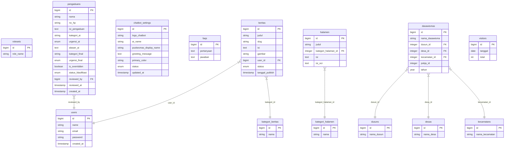

# DOKUMENTASI LENGKAP: SISTEM INFORMASI PUSKESMAS MARUNGGI & ASISTEN AI

Dokumen ini menyajikan panduan komprehensif mengenai arsitektur, modul fitur, skema database (ERD), konfigurasi, dan pengoperasian seluruh komponen sistem informasi pada **Puskesmas Marunggi, Kota Pariaman**.

---

## 1. PENDAHULUAN & GAMBARAN UMUM SISTEM

Sistem Informasi Puskesmas Marunggi dirancang untuk menyatukan layanan portal informasi kesehatan publik, sistem administrasi program pemberdayaan kesejahteraan keluarga (PKK) & Dasawisma, serta integrasi kecerdasan buatan (Artificial Intelligence) untuk mempermudah pelayanan masyarakat dan manajemen internal.

Sistem ini terbagi menjadi empat modul pilar utama:
1. **Portal Publik (CMS Website):** Media informasi resmi seputar layanan poliklinik, jam buka, agenda puskesmas, berita kesehatan terbaru, unduhan dokumen publik, dan informasi FAQs.
2. **Sistem PKK & Dasawisma:** Sistem pendataan kependudukan komunitas, catatan data keluarga, catatan ibu hamil, kegiatan pokja (Kelompok Kerja 1-3), dan monitoring program inovasi desa.
3. **Asisten AI Chatbot:** Asisten virtual interaktif 24/7 di landing page yang menjawab pertanyaan seputar layanan kesehatan secara cerdas berdasarkan basis data pengetahuan internal.
4. **Triage & Klasifikasi Pengaduan AI:** Klasifikasi otomatis kategori keluhan warga dan penilaian tingkat urgensi penanganan aduan menggunakan model bahasa besar Google Gemini.

---

## 2. ARSITEKTUR & TEKNOLOGI

Aplikasi ini dibangun menggunakan arsitektur modern berbiaya rendah dan performa tinggi:

- **Backend Utama (PHP):** Laravel Framework 11/10 yang menangani logika bisnis, autentikasi admin, manajemen data CRUD, serta penjadwalan antrean (*Laravel Queue Database Driver*).
- **Frontend Web:** HTML5, CSS Vanilla (menggunakan layout custom & komponen premium), JavaScript, AlpineJS untuk interaktivitas asinkron, dan Tailwind CSS untuk utilitas grid/styling.
- **Sisi AI (Kecerdasan Buatan):**
  - **Obrolan Chatbot:** Script Python independen (`chat_api.py`) yang dipanggil secara *on-demand* oleh Laravel via Symfony `Process` executor. Ia membaca database pengetahuan statis hasil sinkronisasi database Laravel (`database_knowledge.json`).
  - **Klasifikasi Pengaduan:** Panggilan langsung REST API dari Laravel Queue Job (`ClassifyPengaduanJob`) menuju REST endpoint Google Gemini API (`gemini-2.5-flash`), lengkap dengan validasi skema JSON tanggapan (*Structured JSON Output*).
- **Database:** MySQL.

---

## 3. STRUKTUR DIREKTORI UTAMA PROYEK

```
sitariktageh/
│
├── ai-service/                   # Komponen AI berbasis Python
│   ├── knowledge/                
│   │   ├── database_knowledge.json  # Hasil sinkronisasi basis data Laravel
│   │   └── puskesmas.json        # Knowledge base awal (statis)
│   ├── chat_api.py               # Script CLI pemrosesan Chatbot Asisten
│   ├── main.py                   # CLI interactive mode (Chatbot terminal)
│   ├── prompt.py                 # System Instruction & Prompt Chatbot
│   ├── requirements.txt          # Library Python (google-genai, python-dotenv, rich)
│   └── .env                      # Kunci API Gemini milik Python
│
├── app/
│   ├── Http/Controllers/
│   │   ├── ChatbotController.php # Integrasi pemanggilan chat Python
│   │   ├── LandingpageController.php # Form pengaduan publik & landing page
│   │   └── Admin/
│   │       ├── ChatbotSettingController.php # Pengaturan profil chatbot
│   │       └── PengaduanController.php      # Panel triage/override admin
│   ├── Jobs/
│   │   └── ClassifyPengaduanJob.php         # Klasifikasi pengaduan langsung ke Gemini
│   └── Models/
│       ├── ChatbotSetting.php
│       ├── Faq.php
│       ├── Pengaduan.php
│       └── Admin/                # Model data Portal, PKK, dan Dasawisma
│
├── config/
│   └── services.php              # Pendaftaran konfigurasi API Key Gemini
│
├── database/migrations/          # Migrasi skema tabel MySQL
│
├── docs/                         # Berkas dokumentasi proyek
│
├── resources/
│   ├── views/                    # Tampilan Blade HTML
│   │   ├── admin/
│   │   │   ├── chatbot-setting/  # Panel pengaturan chatbot
│   │   │   └── pengaduan/        # Tampilan kelola aduan (triage & chip)
│   │   └── chatbot-widget.blade.php # Tampilan pop-up chatbot publik
│
└── .env                          # Konfigurasi utama Laravel & API Key Gemini
```

---

## 4. SKEMA DATABASE & ENTITY RELATIONSHIP DIAGRAM (ERD)

### 4.1 Diagram Mermaid ERD

Berikut adalah relasi entitas tabel-tabel utama yang menggerakkan sistem informasi:



### 4.2 Detail Struktur Tabel Penting

#### 1. Tabel `pengaduans`
Menyimpan keluhan masyarakat dan metadata hasil klasifikasi cerdas AI.

| Nama Kolom | Tipe Data | Keterangan |
| :--- | :--- | :--- |
| `id` | bigint (unsigned) | Primary Key |
| `nama` | string(255) | Nama lengkap pelapor |
| `no_hp` | string(255) | Kontak WhatsApp pelapor |
| `isi_pengaduan` | text | Deskripsi lengkap keluhan |
| `kategori_ai` | string(100) | Kategori hasil tebakan awal AI (Audit Trail) |
| `urgensi_ai` | enum('rendah','sedang','tinggi') | Urgensi hasil tebakan awal AI (Audit Trail) |
| `alasan_ai` | text | Argumentasi logis 1 kalimat dari AI |
| `kategori_final` | string(100) | Kategori aktif (bisa di-override oleh Admin) |
| `urgensi_final` | enum('rendah','sedang','tinggi') | Urgensi aktif (bisa di-override oleh Admin) |
| `is_overridden` | boolean | `true` jika admin melakukan perubahan manual dari usulan AI |
| `status_klasifikasi`| enum('pending','selesai','gagal') | Status pelacakan tugas antrean klasifikasi AI |
| `reviewed_by` | bigint (unsigned) | ID User Admin yang menyetujui/mengubah |
| `reviewed_at` | timestamp | Waktu admin menyetujui/mengubah |

#### 2. Tabel `chatbot_settings`
Menyimpan konfigurasi visual dan identitas widget chatbot di landing page.

| Nama Kolom | Tipe Data | Default | Keterangan |
| :--- | :--- | :--- | :--- |
| `id` | bigint (unsigned) | | Primary Key |
| `logo_chatbot` | string(255) | NULL | Path logo kustom chatbot |
| `ai_name` | string(100) | 'Asisten Puskesmas' | Nama asisten AI |
| `puskesmas_display_name`| string(150) | 'Puskesmas Marunggi' | Nama Puskesmas yang dirujuk bot |
| `greeting_message` | text | (Greeting template) | Pesan pembuka asisten saat diklik |
| `primary_color` | string(20) | '#1e6b4d' | Tema warna primer widget chat |
| `status` | enum('active','inactive') | 'active' | Status keaktifan widget di website |

#### 3. Tabel `halamen` (Layanan Poliklinik & Profil)
Menyimpan data statis halaman dan hasil ekstraksi OCR (Optical Character Recognition) berkas SOP/SK yang diunggah.

| Nama Kolom | Tipe Data | Keterangan |
| :--- | :--- | :--- |
| `id` | bigint (unsigned) | Primary Key |
| `judul` | string(255) | Judul halaman/layanan (misal: "Poli Gigi") |
| `kategori_halaman_id` | integer | Kategori (Layanan, Profil, dll) |
| `isi` | text | Isi artikel/deskripsi (format HTML) |
| `isi_ocr` | text | Ekstraksi dokumen SOP mentah untuk dibaca Chatbot AI |

---

## 5. DETAIL INTEGRASI MODUL KECERDASAN BUATAN (AI)

### 5.1 Fitur Asisten AI Chatbot

Fitur Chatbot berjalan secara asinkron tanpa menuntut server Python FastAPI hidup terus-menerus.

```
[Pengguna mengetik di Widget Web] 
             │
             ▼
[Laravel: ChatbotController@send]
             │
             ▼
(Generate `database_knowledge.json` dari MySQL: Sambutan, Layanan, Agenda, Berita, FAQ)
             │
             ▼
(Eksekusi CLI: `python ai-service/chat_api.py "pertanyaan" "NamaAI" "NamaPuskesmas"`)
             │
             ▼
[Python: chat_api.py]
  ├── Memuat database_knowledge.json & puskesmas.json
  ├── Melakukan pencarian context berbasis keyword matching (Top-K)
  └── Mengirim Prompt Context + Pertanyaan ke Google Gemini SDK
             │
             ▼
[Respons Gemini] ──► Diterima Python ──► Output JSON ──► Dibaca Laravel ──► Render HTML
```

#### Komponen Kunci Chatbot:
* **Dynamic Knowledge Generation:** Di `ChatbotController.php`, setiap ada pesan masuk, sistem menyinkronkan data profil Puskesmas, berita terbaru, FAQ, agenda, dan inovasi dari MySQL langsung menjadi berkas JSON terstruktur di [database_knowledge.json](file:///c:/laragon/www/marunggi/sitariktageh/ai-service/knowledge/database_knowledge.json).
* **Context Retrieval (Pencarian Konteks):** Di dalam Python, text masukan dari pengguna dipecah menjadi token-token kata (membersihkan stopword). Token dicocokkan dengan corpus data pengetahuan Puskesmas untuk mengambil 6 informasi paling relevan (Top-6) sebagai bahan rujukan model AI.
* **Guardrails (Batasan AI):** Melalui instruksi sistem (*System Instruction*), Chatbot diprogram secara ketat untuk menolak mendiagnosa penyakit, meresepkan obat, atau menjawab di luar data resmi Puskesmas Marunggi demi keselamatan medis.

---

### 5.2 Fitur Klasifikasi Pengaduan Otomatis

Modul klasifikasi pengaduan memanfaatkan antrean asinkron Laravel (*Laravel Queue Worker*) dan melakukan koneksi REST API secara langsung dari PHP ke Google Gemini API.

```
[Warga mengirim Pengaduan] 
             │
             ▼
[INSERT ke tabel pengaduans (status_klasifikasi = pending)]
             │
             ▼
[Queue Job: ClassifyPengaduanJob didispatch]
             │
             ▼
[ClassifyPengaduanJob@handle]
  ├── Membaca GEMINI_API_KEY dari .env Laravel
  ├── Menyusun prompt klasifikasi (7 Kategori & 3 Rubrik Urgensi)
  └── HTTP POST ke API Google Gemini (dengan Structured JSON responseSchema)
             │
             ▼
[Tanggapan Sukses] ──────────────────────────► [Tanggapan Gagal / Internet Putus]
     │                                                     │
     ▼                                                     ▼
- Update status_klasifikasi = selesai                 - Tangkap exception error
- Simpan kategori_ai, urgensi_ai                      - Jalankan localKeywordClassify (PHP)
- Simpan alasan_ai dari Gemini                         - Simpan alasan_ai berisi detail error
- Kategori & Urgensi aktif terisi                    - Update status_klasifikasi = selesai
```

#### Skema Struktur Respons Gemini yang Diminta (Structured Output):
Laravel mengirimkan instruksi `generationConfig` yang mewajibkan model membalas dengan struktur JSON berikut:
```json
{
  "type": "OBJECT",
  "properties": {
    "kategori": {
      "type": "STRING",
      "enum": ["Pendaftaran & Administrasi", "Pelayanan Petugas/Medis", "Waktu Tunggu & Antrean", "Kebersihan & Fasilitas", "Ketersediaan Obat", "Sarana & Prasarana", "Lainnya"]
    },
    "urgensi": {
      "type": "STRING",
      "enum": ["rendah", "sedang", "tinggi"]
    },
    "alasan": {
      "type": "STRING"
    }
  },
  "required": ["kategori", "urgensi", "alasan"]
}
```

#### Fitur Triage Deteksi Kesalahan (Error Triage & Recovery):
Jika API Gemini mengalami error atau internet terputus, Laravel secara otomatis menjalankan **Local Keyword-Based Classifier** (sistem cadangan pencocok kata kunci lokal). Sistem kemudian menganalisis jenis error:
1. **Error Kuota/Autentikasi (Warning Quota):** Jika pesan error mengandung kata *quota*, *429*, atau *api key*, data `alasan_ai` akan diisi pesan khusus kegagalan kunci API. UI Admin akan menampilkan banner: 
   > ⚠️ *Klasifikasi otomatis gagal (kuota harian API gratis Gemini habis atau API Key tidak valid)...*
2. **Error Jaringan/Koneksi (Warning Network):** Jika terjadi gangguan internet atau server Gemini down, data `alasan_ai` akan mencatat error REST API. UI Admin akan menampilkan banner:
   > ⚠️ *Klasifikasi otomatis gagal (masalah koneksi internet atau REST API Gemini terganggu)...*

Hal ini membantu Admin mengidentifikasi dengan jelas mengapa sistem menggunakan data cadangan lokal tanpa membuat fitur aplikasi macet.

---

## 6. KONFIGURASI LINGKUNGAN (.ENV)

### 6.1 Laravel Root `.env`
Pastikan variabel-variabel berikut ada di file `.env` pada direktori root proyek Laravel:

```env
# Koneksi Basis Data
DB_CONNECTION=mysql
DB_HOST=127.0.0.1
DB_PORT=3306
DB_DATABASE=simpkkdb
DB_USERNAME=root
DB_PASSWORD=

# Driver Antrean (Wajib database agar asinkron berfungsi)
QUEUE_CONNECTION=database

# Kunci API Resmi Google Gemini (Digunakan untuk Klasifikasi Pengaduan)
GEMINI_API_KEY=<API_KEY_GEMINI_ANDA>
```

### 6.2 Python Service `.env` (`ai-service/.env`)
Pastikan file `.env` di dalam folder `ai-service/` memiliki variabel berikut:

```env
# Kunci API Resmi Google Gemini (Digunakan untuk Chatbot)
GEMINI_API_KEY=<API_KEY_GEMINI_ANDA>
GEMINI_MODEL=gemini-2.5-flash
```

---

## 7. PETUNJUK OPERASIONAL PENGEMBANGAN (LOCAL DEV)

Untuk menjalankan seluruh fitur ini di komputer lokal Anda, Anda **tidak perlu menjalankan FastAPI Python** lagi. Cukup ikuti langkah berikut:

### Langkah 1: Jalankan Web Server Laravel
Membuka port web utama untuk diakses di browser:
```bash
php artisan serve
```

### Langkah 2: Jalankan Asset Compiler (Vite)
Mengompilasi asset Javascript & styling CSS secara real-time:
```bash
npm run dev
```

### Langkah 3: Jalankan Queue Worker Laravel (Wajib)
Menjalankan background listener untuk memproses tugas antrean klasifikasi pengaduan AI saat ada warga yang mengirim aduan baru:
```bash
php artisan queue:work
```

---
*Dokumentasi ini diperbarui secara otomatis setelah optimasi integrasi langsung API Gemini ke dalam sistem Laravel tanpa perantara FastAPI.*
