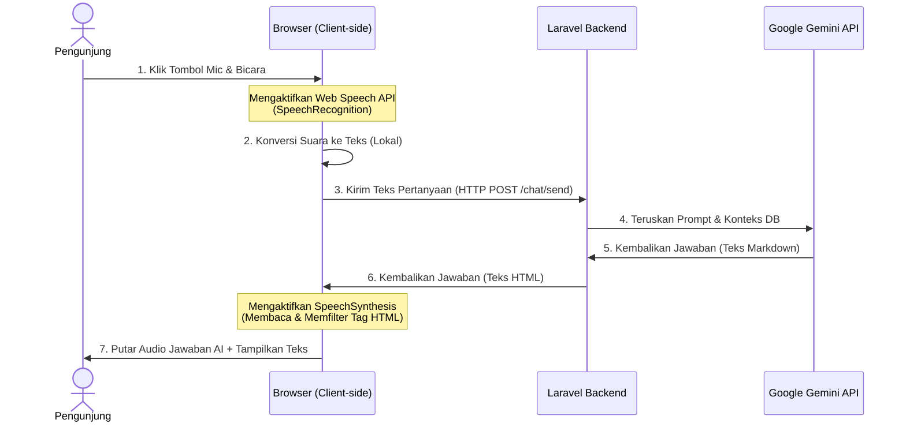

# Konsep & Spesifikasi Teknis: Voice-to-Voice AI Chatbot
## Integrasi Fitur Aksesibilitas Obrolan Suara Interaktif (Bebas Limit & Gratis)

Dokumen ini merinci konsep desain, alur kerja (*workflow*), arsitektur, serta spesifikasi implementasi untuk fitur **Voice-to-Voice AI Chatbot** pada website Puskesmas. Fitur ini dirancang untuk berjalan sepenuhnya di sisi browser klien (client-side) sehingga **100% gratis** dan **bebas dari batasan kuota API tambahan**.

---

## 1. Latar Belakang & Tujuan
Banyak pengunjung website Puskesmas (terutama golongan lanjut usia atau penyandang tunanetra) mengalami kesulitan dalam mengetik pertanyaan di layar ponsel/komputer yang kecil.

Tujuan dari fitur ini adalah menyediakan **Asisten Suara Interaktif** di mana pengguna dapat:
1. Berbicara langsung melalui mikrofon untuk menanyakan informasi (menggantikan mengetik).
2. Mendengarkan jawaban asisten AI dibacakan secara otomatis dengan suara manusia alami (menggantikan membaca teks panjang).

---

## 2. Arsitektur & Alur Kerja (Workflow)

Proses konversi suara dilakukan secara hibrida menggunakan API bawaan browser pengunjung untuk pemrosesan suara, dan API Gemini untuk pemrosesan logika jawaban.

### Diagram Alur Kerja:



### Penjelasan Langkah Detail:
1. **Perekaman Suara:** Pengunjung mengeklik tombol mikrofon di halaman chat. Browser meminta izin akses mikrofon dan mulai mendengarkan.
2. **Speech-to-Text (STT):** Browser menggunakan mesin pengenal suara lokal perangkat (Google/Apple Speech Service) untuk menerjemahkan ucapan menjadi string teks Bahasa Indonesia secara instan.
3. **Pengiriman Pesan:** Teks hasil transkripsi dimasukkan ke kolom input chat dan dikirim ke server Laravel melalui request AJAX standard.
4. **Pemrosesan AI:** Server memproses pertanyaan dan data database menggunakan model Gemini, lalu mengirimkan jawaban teks kembali ke browser.
5. **Text-to-Speech (TTS):** Browser menerima teks jawaban, membersihkan format HTML/Markdown, lalu menggunakan mesin *SpeechSynthesis* browser untuk menyuarakan teks tersebut menggunakan intonasi suara Bahasa Indonesia.

---

## 3. Skema Antarmuka & State UI/UX

Tombol mikrofon pada form input memiliki 4 keadaan (*state*) visual yang dinamis untuk memberikan petunjuk kepada pengguna:

| No | State Visual | Indikator Ikon | Efek Animasi | Arti Keadaan |
| :--- | :--- | :--- | :--- | :--- |
| 1 | **Standby** | `mic` (Abu-abu) | Tidak ada | Siap merekam suara. |
| 2 | **Recording** | `graphic_eq` (Merah) | Pulse (Berkedip lambat) | Sedang mendengarkan suara pengguna. |
| 3 | **Processing** | `hourglass_empty` | Spin (Berputar) | Mengirim data ke server dan menunggu jawaban Gemini. |
| 4 | **Speaking** | `volume_up` (Warna Tema) | Ripple (Gelombang) | AI sedang membacakan jawabannya lewat audio. |

---

## 4. Konsep Implementasi Kode (Frontend JavaScript)

Seluruh logika fitur ini berada di sisi klien ([chat.blade.php](file:///c:/laragon/www/marunggi/sitariktageh/resources/views/chat.blade.php)) tanpa memerlukan modifikasi pada kode backend Laravel.

### A. Fitur 1: Mengubah Suara User menjadi Teks (Speech-to-Text)
```javascript
const SpeechRecognition = window.SpeechRecognition || window.webkitSpeechRecognition;

if (SpeechRecognition) {
    const recognition = new SpeechRecognition();
    recognition.lang = 'id-ID'; // Set Bahasa Indonesia
    recognition.interimResults = false;

    // Trigger perekaman
    document.getElementById('mic-btn').addEventListener('click', () => {
        recognition.start();
        setUiState('recording');
    });

    recognition.onresult = (event) => {
        const text = event.results[0][0].transcript;
        document.getElementById('chat-input').value = text;
        submitChat(); // Kirim pesan otomatis setelah selesai bicara
    };

    recognition.onend = () => {
        setUiState('standby');
    };
}
```

### B. Fitur 2: Membacakan Jawaban AI dengan Suara (Text-to-Speech)
```javascript
function speakResponse(textHTML) {
    // 1. Hentikan suara lain yang sedang berjalan jika ada
    window.speechSynthesis.cancel();

    // 2. Bersihkan tag HTML agar tidak ikut terbaca oleh robot (seperti strong, br, a)
    const tempDiv = document.createElement("div");
    tempDiv.innerHTML = textHTML;
    const cleanText = tempDiv.textContent || tempDiv.innerText || "";

    // 3. Konfigurasi objek suara
    const utterance = new SpeechSynthesisUtterance(cleanText);
    utterance.lang = 'id-ID';

    // 4. Pilih suara Bahasa Indonesia terbaik yang tersedia di browser perangkat
    const voices = window.speechSynthesis.getVoices();
    const idVoice = voices.find(v => v.lang.includes('id') || v.lang.includes('ID'));
    if (idVoice) {
        utterance.voice = idVoice;
    }

    // 5. Jalankan pembacaan suara
    window.speechSynthesis.speak(utterance);
}
```

---

## 5. Keamanan & Penanganan Fallback
Untuk menjaga keandalan sistem pada seluruh jenis perangkat dan browser, sistem mengimplementasikan aturan kegagalan aman (*safe fallback*):
1. **Deteksi Dukungan Browser:** Jika browser pengunjung sangat lama atau tidak mendukung `SpeechRecognition` (misalnya browser bawaan dalam beberapa aplikasi Android), tombol mic akan **otomatis disembunyikan** lewat CSS, dan input teks normal tetap berjalan.
2. **Izin Akses Mikrofon:** Jika pengguna menolak memberikan izin akses mikrofon, sistem akan memicu notifikasi ramah yang memberitahu pengguna cara memberikan izin melalui pengaturan browser.
3. **Mute/Stop button:** Menyediakan tombol "Hentikan Suara" jika pengguna merasa terganggu dan ingin mematikan suara AI di tengah jalan saat membacakan artikel panjang.
