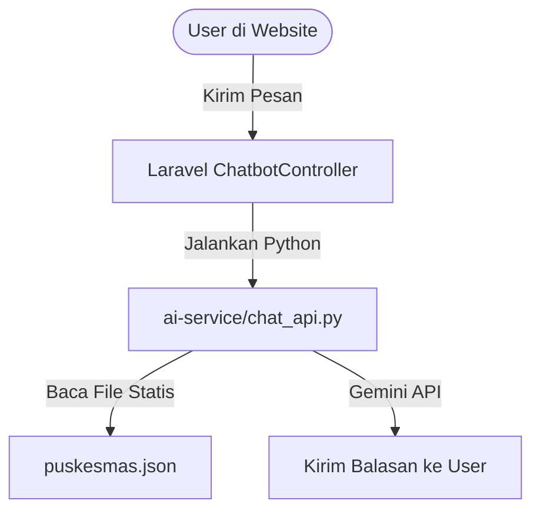
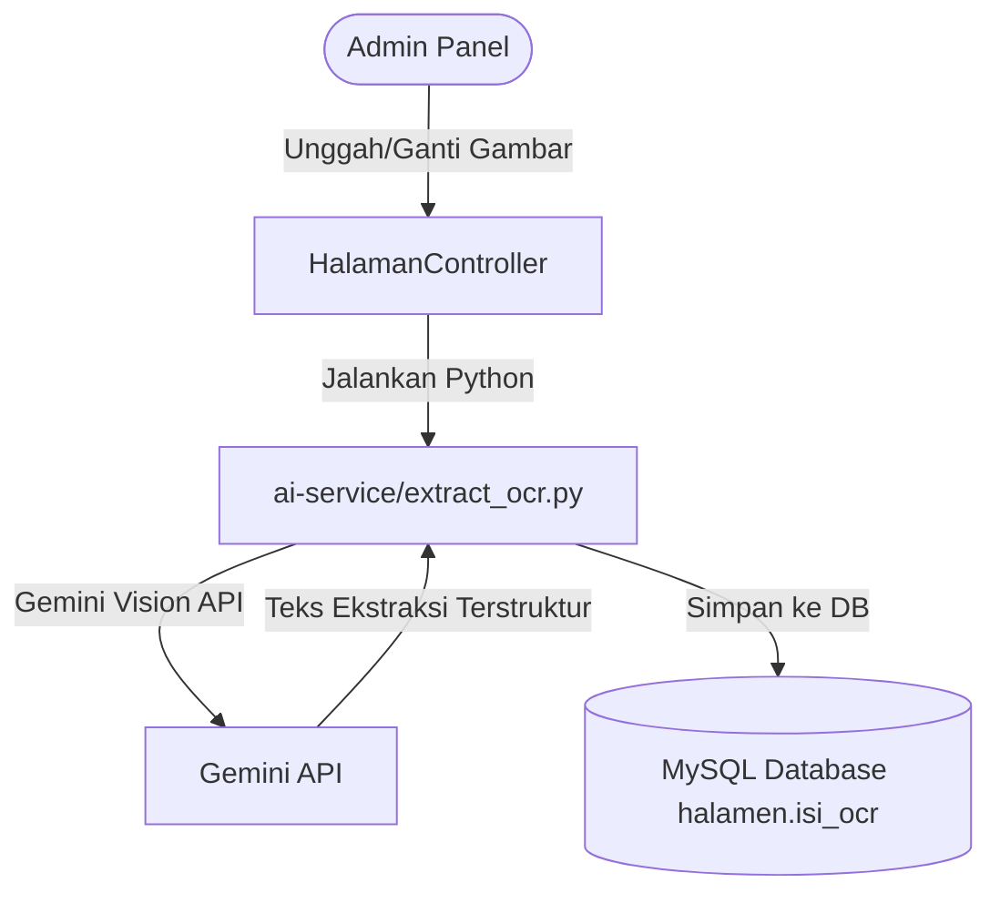

# Dokumentasi Migrasi Chatbot ke Database

Dokumentasi ini menjelaskan langkah-langkah, alur sistem, dan struktur data yang diubah untuk memigrasikan basis pengetahuan (knowledge base) chatbot dari file JSON statis (`puskesmas.json`) ke data dinamis dari database.

---

## 1. Arsitektur Alur Sistem Baru

Sebelumnya chatbot memproses pesan dengan alur berikut:


Setelah dilakukan migrasi, alurnya berubah menjadi dinamis:
```mermaid
graph TD
    User([User di Website]) -->|Kirim Pesan| Controller[Laravel ChatbotController]
    Controller -->|Query Database & strip_tags| DB[(MySQL Database halamen.isi_ocr)]
    DB -->|Format Array & Ekspor| JSON_Dyn[database_knowledge.json]
    Controller -->|Jalankan Python| Script[ai-service/chat_api.py]
    Script -->|Baca File Dinamis| JSON_Dyn
    Script -->|Gemini API (Hanya Teks)| Jawaban[Kirim Balasan ke User]
```

Dan untuk alur ekstraksi OCR gambar (offline/admin) saat gambar diunggah/diperbarui:


Dengan arsitektur ini, **sistem tidak membutuhkan library koneksi database tambahan di sisi Python** (seperti `mysql-connector` atau `pymysql`), melainkan memanfaatkan koneksi database bawaan Laravel yang sudah aman dan stabil.

---

## 2. Langkah-Langkah Perubahan Kode

### A. Menonaktifkan `puskesmas.json` di Python
Pada file `ai-service/main.py`, baris kode untuk path basis pengetahuan diubah agar mengarah ke `database_knowledge.json`:
```python
# Di-deaktifkan sementara sesuai permintaan user (tidak dihapus)
# KNOWLEDGE_PATH = BASE_DIR / "knowledge" / "puskesmas.json"
KNOWLEDGE_PATH = BASE_DIR / "knowledge" / "database_knowledge.json"

# Jika file database_knowledge.json belum digenerate oleh Laravel, fallback ke puskesmas.json
if not KNOWLEDGE_PATH.exists():
    KNOWLEDGE_PATH = BASE_DIR / "knowledge" / "puskesmas.json"
```
*Catatan: Fitur fallback ditambahkan agar ketika skrip Python dijalankan langsung melalui terminal (`python main.py`) untuk keperluan debug lokal, skrip tidak mengalami error jika file `database_knowledge.json` belum terbuat.*

### B. Membuat Generator Data Dinamis di Laravel Controller
Di dalam `App\Http\Controllers\ChatbotController.php`, ditambahkan fungsi `generateDatabaseKnowledge()` yang dipanggil secara otomatis pada setiap request pesan sebelum menjalankan proses Python.

Fungsi ini melakukan kueri (*query*) terhadap tabel-tabel publik berikut:
1. **`sambutans`** (Sambutan Kepala Puskesmas, Nama, Motto).
2. **`halamen` & `kategori_halamen`** (Halaman Informasi seperti Visi & Misi, Sejarah, Program Pokok, Struktur Organisasi, Jadwal Pelayanan).
3. **`agendas`** (Hanya data kegiatan mendatang dengan status `upcoming`).
4. **`beritas`** (Hanya berita yang statusnya sudah dipublikasikan `publish`).
5. **`infografis` & `galeris`** (Informasi infografis program dan deskripsi kegiatan galeri).
6. **`dokumen`** (Hanya dokumen publik yang statusnya aktif `is_active = 1`).
7. **`faqs`** (Pertanyaan dan jawaban yang sering diajukan).
8. **`inovasi1`** (Profil inovasi program puskesmas yang aktif).
9. **`chatbot_settings`** (Identitas nama asisten AI dan pesan sambutan chatbot).

Data-data tersebut kemudian disaring (menghilangkan tag HTML dengan `strip_tags`), digabungkan ke dalam bentuk array, dan diekspor menjadi file JSON terformat di `ai-service/knowledge/database_knowledge.json`.

---

## 3. Struktur Data `database_knowledge.json`

Hasil ekspor dari database akan menghasilkan struktur JSON seperti berikut:
```json
{
  "profile": {
    "nama_puskesmas": "Puskesmas Marunggi",
    "sambutan_pejabat": {
      "nama": "WAHYU KHAIRI",
      "judul": "SELAMAT DATANG",
      "motto": "SUKSES MUDAH...",
      "isi": "isi sambutan pejabat..."
    }
  },
  "halaman_informasi": [
    {
      "kategori": "Visi dan Misi",
      "judul": "Visi dan Misi PKK",
      "isi": "Menjadi Puskesmas dengan..."
    }
  ],
  "acara_mendatang": [
    {
      "nama_kegiatan": "Goro Bersama",
      "tanggal": "2026-07-22",
      "waktu": "08:00:00 s/d 12:00:00",
      "lokasi": "Balaikota",
      "deskripsi": "Goro Bersama",
      "penyelenggara": "Gabungan"
    }
  ],
  "berita": [
    {
      "judul_berita": "...",
      "isi_berita": "...",
      "tanggal_publish": "..."
    }
  ],
  "infografis": [
    {
      "nama": "...",
      "keterangan": "..."
    }
  ],
  "dokumen_publik": [
    {
      "judul": "...",
      "kategori": "...",
      "deskripsi": "..."
    }
  ],
  "faqs": [
    {
      "pertanyaan": "...",
      "jawaban": "..."
    }
  ],
  "inovasi_program": [
    {
      "judul_inovasi": "...",
      "deskripsi": "...",
      "tahun": "..."
    }
  ],
  "ai_assistant_identity": {
    "nama_asisten": "Asisten AI",
    "greeting_message": "Halo, ada yang bisa saya bantu?"
  }
}
```

---

## 4. Keuntungan Pendekatan Ini

1. **Eksklusi Data Sensitif Otomatis**: Kueri database diatur secara spesifik di Laravel sehingga data sensitif seperti tabel `users`, `sessions`, `password_reset_tokens`, dll. sama sekali tidak tersentuh atau tereksplorasi oleh AI.
2. **Kesesuaian Data Real-Time**: Chatbot akan selalu menjawab berdasarkan perubahan data terkini di database admin panel (misalnya jika ada penambahan agenda baru atau FAQ baru).
3. **Optimasi Kinerja**: Proses kueri dan konversi JSON berlangsung sangat cepat (di bawah 10ms) dan file database_knowledge.json disimpan di lokal server sehingga tidak membebani performa server.

---

## 5. Perubahan Lanjutan (Optimasi Konteks & Waktu Real-Time)

Setelah migrasi database pertama selesai, dilakukan dua perubahan penting lainnya untuk memperluas pemahaman konteks pertanyaan pengguna:

### A. Sinkronisasi Kata Kunci Kategori (`CATEGORY_KEYWORDS`)
Pada file `ai-service/main.py`, daftar kata kunci diubah agar selaras dengan skema database baru:
* Kategori seperti `vision_mission`, `history`, dan `operational_hours` disatukan ke dalam kategori `halaman_informasi` (karena data tersebut kini diambil dari satu tabel `halamen`).
* Menambahkan kategori `acara_mendatang` yang dipicu oleh kata kunci *"agenda"*, *"acara"*, *"kegiatan"*, *"bulan"*, dan *"kalender"*. Hal ini memastikan sistem pencarian (retrieval) dapat menemukan agenda dari database saat kata kunci tersebut ditanyakan.

### B. Injeksi Waktu Hari Ini secara Dinamis (Real-Time)
Gemini secara bawaan tidak mengetahui tanggal saat ini, sehingga tidak bisa menjawab pertanyaan relatif waktu (seperti *"hari ini"*, *"besok"*, atau *"bulan ini"*). 
* **Solusi**: Di dalam file `ai-service/prompt.py` (pada fungsi `build_prompt`), ditambahkan kalkulator waktu yang menghasilkan string tanggal dalam format Indonesia (misalnya: `"15 Juli 2026"`).
* String tanggal ini secara dinamis disuntikkan ke dalam prompt sebagai blok `WAKTU SEKARANG (WIB)` sebelum dikirim ke Gemini.
* Dengan ini, model AI dapat mencocokkan tanggal pada `acara_mendatang` dengan tanggal hari ini, lalu menyaring serta mengelompokkan acara secara tepat dan akurat.

### C. Menghindari Auto-Refresh Halaman oleh Vite Watcher
Ketika chatbot mengirim pesan, Laravel secara otomatis menulis file database baru ke `ai-service/knowledge/database_knowledge.json`. Pada mode pengembangan lokal, Vite dev server (`npm run dev`) mendeteksi perubahan file ini dan secara otomatis memicu isi ulang halaman (*Full Page Reload / Refresh*), yang membersihkan riwayat obrolan user.
* **Solusi**: Pada file `vite.config.js`, ditambahkan konfigurasi `server.watch.ignored` untuk mengabaikan folder `ai-service/`:
  ```javascript
  server: {
      watch: {
          ignored: ['**/ai-service/**'],
      },
  }
  ```
* Dengan pengecualian ini, penulisan data basis pengetahuan dinamis tidak akan mengganggu sesi chat di halaman depan dan browser tidak akan memuat ulang secara otomatis.

### D. Membaca Informasi Gambar (Pre-extraction OCR)
Untuk meminimalisir latensi respon chatbot dan menghemat penggunaan token Gemini API secara drastis, dilakukan migrasi dari Real-time OCR ke Pre-extraction OCR:
1. **Utilitas Python**: Skrip kustom [extract_ocr.py](file:///c:/laragon/www/marunggi/sitariktageh/ai-service/extract_ocr.py) dibuat secara khusus untuk memicu Gemini Vision API mengekstrak teks visual gambar ke dalam format Markdown terstruktur (tabel, daftar, waktu, kontak, dsb) dalam Bahasa Indonesia.
2. **Database Integration**: Ditambahkan kolom `isi_ocr` pada tabel `halamen` via migrasi. Saat migrasi dijalankan, seluruh gambar lama di-backfill secara retroaktif.
3. **Admin Trigger**: Saat admin mengunggah atau mengganti konten yang memuat gambar di form halaman informasi ([HalamanController.php](file:///c:/laragon/www/marunggi/sitariktageh/app/Http/Controllers/Admin/HalamanController.php)), Laravel secara otomatis mendeteksi tag ``, mengekstrak file lokalnya, mengeksekusi `extract_ocr.py`, dan menyimpannya di kolom `isi_ocr`.
4. **Chatbot Runtime**: [ChatbotController.php](file:///c:/laragon/www/marunggi/sitariktageh/app/Http/Controllers/ChatbotController.php) menyertakan `isi_ocr` pada JSON basis pengetahuan dan membersihkan tag HTML pada content `isi` menggunakan `strip_tags()`. Skrip [main.py](file:///c:/laragon/www/marunggi/sitariktageh/ai-service/main.py) diubah agar tidak lagi memindai folder `/uploads/` dan tidak mengirimkan biner gambar ke Gemini API saat chat berlangsung.

2. **Sistem Tautan & Tombol Navigasi Layanan**:
   * Laravel Controller menyisipkan field `"url"` untuk setiap baris data di `database_knowledge.json`. Contohnya, untuk profil halaman informasi menggunakan url terenkripsi: `url('/landing/halaman/' . encrypt($h->kategori_halaman_id))`.
   * Melalui *System Instruction* di [prompt.py](file:///c:/laragon/www/marunggi/sitariktageh/ai-service/prompt.py), Gemini diinstruksikan untuk menyertakan tautan tersebut di akhir jawabannya dengan format markdown standard: `[Teks Tombol](url)`.
   * Sebelum balasan dikirim kembali ke tampilan chat (Blade), [ChatbotController.php](file:///c:/laragon/www/marunggi/sitariktageh/app/Http/Controllers/ChatbotController.php) mengubah format link markdown `[Teks](url)` menjadi tag HTML `<a>` dengan styling khusus agar terlihat seperti tombol/link navigasi:
     ```php
     $answerHTML = preg_replace('/\[(.*?)\]\((.*?)\)/', '<a href="$2" class="text-primary hover:underline font-semibold" target="_blank">$1</a>', $answerHTML);
     ```

3. **Membaca dan Merangkum Berita**:
   * Konten berita lengkap (`isi_berita`) dalam bentuk HTML disimpan secara utuh tanpa dibersihkan tag-nya agar AI dapat membaca keseluruhan konteks artikel berita.
   * Ditambahkan aturan instruksi ke-11 pada *System Instruction* agar chatbot mampu menyusun ringkasan (garis besar/outline) yang terstruktur saat pengguna bertanya mengenai kabar atau berita puskesmas terbaru.

---

## 6. Rangkuman Berkas & Tahapan Perubahan (Fase)

Berikut adalah tabel komprehensif yang merangkum berkas-berkas yang diubah/dibuat serta tahapan (fase) eksekusinya:

| Fase | Nama Fitur / Modul | Berkas yang Terlibat | Tindakan | Tujuan / Dampak Perubahan |
| :--- | :--- | :--- | :--- | :--- |
| **Fase 1** | Modul Setting AI Chatbot | [ChatbotSettingController.php](file:///c:/laragon/www/marunggi/sitariktageh/app/Http/Controllers/Admin/ChatbotSettingController.php) | **[NEW]** | Menyediakan endpoint backend untuk pengaturan identitas chatbot di panel admin. |
| | | [ChatbotSetting.php](file:///c:/laragon/www/marunggi/sitariktageh/app/Models/ChatbotSetting.php) | **[NEW]** | Model Eloquent Laravel untuk tabel `chatbot_settings`. |
| | | [2026_07_14_105838_create_chatbot_settings_table.php](file:///c:/laragon/www/marunggi/sitariktageh/database/migrations/2026_07_14_105838_create_chatbot_settings_table.php) | **[NEW]** | Migrasi database untuk membuat tabel konfigurasi chatbot. |
| | | [ChatbotSettingsSeeder.php](file:///c:/laragon/www/marunggi/sitariktageh/database/seeders/ChatbotSettingsSeeder.php) | **[NEW]** | Seeders data default untuk asisten AI dan nama puskesmas. |
| | | [index.blade.php](file:///c:/laragon/www/marunggi/sitariktageh/resources/views/admin/chatbot-setting/index.blade.php) | **[NEW]** | Tampilan panel admin kustomisasi chatbot dengan live simulator preview. |
| | | [web.php](file:///c:/laragon/www/marunggi/sitariktageh/routes/web.php) | **[MODIFY]** | Mendaftarkan route admin setting AI dan chatbot. |
| | | [layout.blade.php](file:///c:/laragon/www/marunggi/sitariktageh/resources/views/template/layout.blade.php) | **[MODIFY]** | Menambahkan item sidebar "Setting AI Chatbot" pada halaman admin. |
| | | [chat.blade.php](file:///c:/laragon/www/marunggi/sitariktageh/resources/views/chat.blade.php) | **[MODIFY]** | Memperbarui UI gelembung chat dan header obrolan agar menggunakan warna tema dinamis dari database. |
| **Fase 2** | Optimasi Aset & Infrastruktur | [navbar.blade.php](file:///c:/laragon/www/marunggi/sitariktageh/resources/views/navbar.blade.php) | **[MODIFY]** | Mengganti Tailwind CDN dengan asset loading `@vite` jika file manifest build tersedia. |
| | | [layout.blade.php](file:///c:/laragon/www/marunggi/sitariktageh/resources/views/template/layout.blade.php) | **[MODIFY]** | Mengganti asset loading Tailwind CDN dengan `@vite` pada admin layout. |
| | | [guest.blade.php](file:///c:/laragon/www/marunggi/sitariktageh/resources/views/layouts/guest.blade.php) | **[MODIFY]** | Mengganti asset loading Tailwind CDN dengan `@vite` pada auth layout. |
| | | [vite.config.js](file:///c:/laragon/www/marunggi/sitariktageh/vite.config.js) | **[MODIFY]** | Menambahkan pengecualian watch folder `ai-service/` untuk menghentikan reload loop saat file knowledge terbuat. |
| | | [filesystems.php](file:///c:/laragon/www/marunggi/sitariktageh/config/filesystems.php) | **[MODIFY]** | Mengubah target direktori `public` disk langsung ke folder fisik `public/storage` agar kompatibel dengan sistem Windows/Laragon. |
| | | [create.blade.php](file:///c:/laragon/www/marunggi/sitariktageh/resources/views/admin/sambutan/create.blade.php) | **[MODIFY]** | Menambahkan script Javascript `previewFoto` untuk live image preview saat pembuatan data. |
| | | [edit.blade.php](file:///c:/laragon/www/marunggi/sitariktageh/resources/views/admin/sambutan/edit.blade.php) | **[MODIFY]** | Menambahkan script Javascript `previewFoto` untuk live image preview saat pengubahan data sambutan. |
| | | [HalamanController.php](file:///c:/laragon/www/marunggi/sitariktageh/app/Http/Controllers/Admin/HalamanController.php) | **[MODIFY]** | Memperbaiki bug fatal crash pada action delete dengan memanggil query builder `delete()` secara langsung. |
| **Fase 3** | Peningkatan Kognitif AI (Multimodal & UI) | [ChatbotController.php](file:///c:/laragon/www/marunggi/sitariktageh/app/Http/Controllers/ChatbotController.php) | **[MODIFY]** | Mengimplementasikan method `generateDatabaseKnowledge()` untuk memicu ekspor JSON dinamis, parsing Markdown links menjadi link visual, dan integrasi parameters. |
| | | [main.py](file:///c:/laragon/www/marunggi/sitariktageh/ai-service/main.py) | **[MODIFY]** | Mengubah database source ke `database_knowledge.json`, memperluas regex kata kunci kategori, dan menambahkan pembacaan multimodal local image part. |
| | | [prompt.py](file:///c:/laragon/www/marunggi/sitariktageh/ai-service/prompt.py) | **[MODIFY]** | Menyuntikkan helper tanggal hari ini, memperbarui System Instructions untuk output format markdown link, dan instruksi penulisan outline berita. |
| **Fase 4** | Optimasi Biaya & Latensi (Pre-extraction OCR) | [extract_ocr.py](file:///c:/laragon/www/marunggi/sitariktageh/ai-service/extract_ocr.py) | **[NEW]** | Utilitas python untuk memproses ekstraksi OCR gambar terstruktur secara offline. |
| | | [2026_07_15_142435_add_isi_ocr_to_halamen_table.php](file:///c:/laragon/www/marunggi/sitariktageh/database/migrations/2026_07_15_142435_add_isi_ocr_to_halamen_table.php) | **[NEW]** | Migrasi database penambahan kolom `isi_ocr` dan backfill data otomatis. |
| | | [HalamanController.php](file:///c:/laragon/www/marunggi/sitariktageh/app/Http/Controllers/Admin/HalamanController.php) | **[MODIFY]** | Memicu fungsi `extractOcrFromHtml` saat data ditambahkan/diperbarui oleh admin. |
| | | [ChatbotController.php](file:///c:/laragon/www/marunggi/sitariktageh/app/Http/Controllers/ChatbotController.php) | **[MODIFY]** | Mengekspor kolom `isi_ocr` ke JSON dan membersihkan tag HTML `isi`. |
| | | [main.py](file:///c:/laragon/www/marunggi/sitariktageh/ai-service/main.py) | **[MODIFY]** | Menghapus pemindaian biner gambar dan pengiriman berkas multimodal saat chat runtime. |

---

## 7. Panduan Perawatan (Maintenance) & Troubleshooting

### A. Pengujian & Ekstraksi OCR Manual
Jika admin ingin menguji atau menjalankan ulang OCR secara manual untuk sebuah file gambar tertentu di server, gunakan perintah python berikut dari folder `ai-service`:
```bash
python extract_ocr.py ../public/uploads/nama_file_gambar.jpg
```
Output akan mengembalikan string JSON dengan format:
`{"status": "success", "ocr_text": "Teks hasil ekstraksi..."}`

### B. Penanganan Masalah (Troubleshooting)
1. **Kolom `isi_ocr` Kosong**:
   - Pastikan API Key di file `ai-service/.env` terisi dengan benar dan memiliki kuota yang cukup.
   - Pastikan path file gambar di `public/uploads/` sesuai dengan nama file yang tertera di dalam tag `src` HTML.
   - Periksa log Laravel di `storage/logs/laravel.log` untuk melihat detail pesan kesalahan dari eksekusi Python.
2. **Kueri Terlalu Lama Saat Migrasi**:
   - Jika terdapat puluhan gambar lama di database saat migrasi dijalankan, proses backfill migrasi akan memerlukan waktu beberapa menit karena memanggil API Gemini satu per satu. Pastikan execution time PHP diatur cukup lama atau biarkan proses selesai di background.

